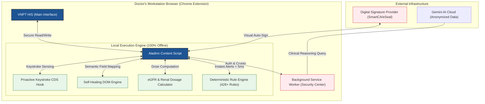

# 🗺️ ARCHITECTURE MAP: Aladinn v2 (Clinical OS)

## 1. Overview
**Aladinn v2** is designed as a "Clinical OS" (Trợ lý Lâm sàng AI) running directly as an Ambient Assistant in the doctor's browser on top of the **VNPT HIS** platform. It strictly follows a "Non-Invasive & Non-Replacement" philosophy. The architecture is segregated into three primary core layers to ensure high performance, total data privacy, and clinical safety:
1. **Ambient Adaptive UI (Tầng Giao Diện Thích Ứng):** Glassmorphism interface that overlays HIS without blocking critical medical workflows.
2. **Safety & Security Guard (Tầng Bảo Mật và Xác Thực):** Enforces a "Double-Lock" context system to prevent patient cross-contamination and anonymizes all PHI (Protected Health Information) locally.
3. **Local Decision Engine (Tầng Quyết Định Lâm Sàng Cục Bộ):** A 100% offline rule engine for real-time drug interaction alerts (426+ rules), eGFR renal dose calculation, and self-healing DOM adaptation.

---

## 2. Mermaid.js Architecture Diagram

---

## 3. Blast Radius Matrix (Risk & Mitigation Mapping)
This matrix describes the impact if a particular module fails and the specific mitigation guards put in place.

| Component / Module | Primary Responsibility | Blast Radius (Impact of Failure) | Mitigation & Safety Guard |
| :--- | :--- | :--- | :--- |
| `patient-context-guard.js` | **Double-Lock Patient Identity:** Verifies Patient ID + Visit ID before any auto-fill action. | **Critical:** Patient Cross-Contamination (Writing wrong patient's data). | **Fail Closed:** Halts all AI injections and purges temporary cache if DOM and Context diverge. |
| `phi-redactor.js` | **PHI Anonymization:** Automatically scrubs PII/PHI (Names, Phone, Address, IDs). | **High:** PHI Data Leakage to external Cloud AI services. | Runs strictly offline using deterministic Regex and Dictionaries before external dispatch. |
| `egfr-alerts.js` | **Renal Dosage Calculation:** Calculates eGFR to warn about renal toxic prescriptions. | **Critical:** Wrong clinical dose suggestion leading to renal failure. | Cross-checks with CKD-EPI (2021) and Cockcroft-Gault. Features auto unit-conversion (µmol/L to mg/dL) detection. |
| `engine.js` (Local CDS) | **Real-Time Clinical Decision Support:** Validates prescriptions against 426+ rules. | **Medium:** Alert fatigue or missed dangerous drug interactions. | Tiered alert system (Critical/High/Moderate). Works 100% offline preventing downtime. |
| `self-healing.js` | **DOM Semantic Mapping:** Connects AI outputs to HIS DOM input fields robustly. | **Low:** Extension fails to inject data; fallback to manual entry. | **Semantic Healing:** Scans nearby Vietnamese labels dynamically if DOM IDs/Classes change. |
| `ai-client.js` | **Crypto & Network Tunnel:** AES-GCM encryption of API keys. | **High:** Unauthorized access or leakage of LLM credentials. | Keys stay in RAM, bound to session. Auto-purged after 30 mins of inactivity or upon logout. |
| `api-bridge.js` / `ajax-interceptor.js` | **Network Snooping:** Listens to HIS API responses to sync patient data passively. | **Medium:** State desync between UI and Backend. | **Read-Only Snoop:** Never executes unauthorized POST/PUT requests. "Fail Closed" upon network errors. |
