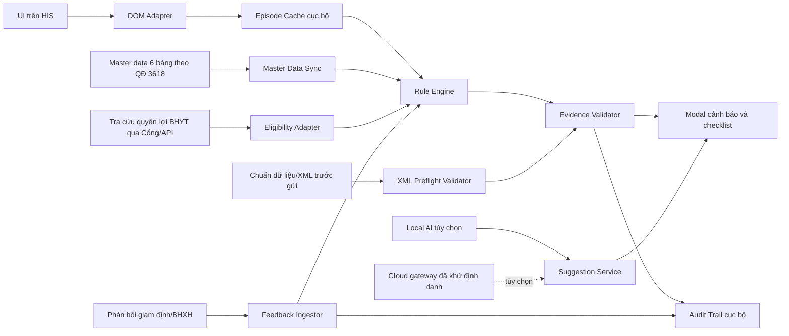
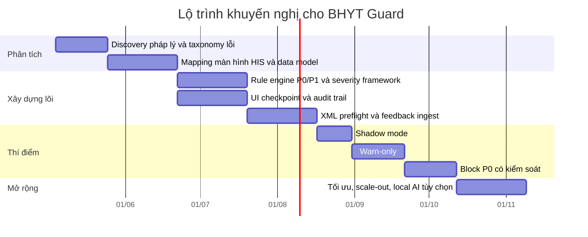

# Kế hoạch triển khai chi tiết BHYT Guard cho Aladinn

## Tóm tắt điều hành

BHYT Guard nên được triển khai như một lớp **kiểm lỗi trước giám định và trước gửi thanh toán** đặt ngay trong luồng làm việc của HIS, với mục tiêu chuyển khâu phát hiện sai sót từ “sau khi BHXH cảnh báo hoặc từ chối” sang “ngay khi bác sĩ, điều dưỡng, dược, kế toán viện phí và bộ phận tổng hợp hoàn tất hồ sơ”. Nhu cầu này là thực tế: theo thống kê của BHXH Việt Nam, chỉ trong 9 tháng năm 2024, số tiền từ chối thanh toán chi phí KCB BHYT đã là 1.159,3 tỷ đồng, tương đương 0,98% số chi đề nghị thanh toán; đồng thời hướng dẫn quyết toán 2026 nhấn mạnh phải rà soát **toàn bộ chi phí**, bảo đảm chi phí đúng phạm vi quyền lợi, mức hưởng, hồ sơ bệnh án và chứng từ hợp pháp, và dữ liệu thanh toán phải khớp dữ liệu điện tử đã gửi. citeturn31search0turn32search3

Về pháp lý, BHYT Guard không nên xây theo logic cũ chỉ bám Nghị định 146/2018. Tại thời điểm hiện tại, trục quy định phải bám vào chuỗi văn bản hiện hành do entity["organization","Quốc hội Việt Nam","national legislature"], entity["organization","Chính phủ Việt Nam","executive branch"], entity["organization","Bộ Y tế","vietnam"] và entity["organization","Bảo hiểm xã hội Việt Nam","vietnam social security"] ban hành, trong đó lõi pháp lý mới là Luật số 51/2024/QH15 có hiệu lực từ 01/07/2025, Nghị định 188/2025/NĐ-CP có hiệu lực từ 15/08/2025, cùng các văn bản về điều kiện thanh toán thuốc, vật tư y tế, dịch vụ kỹ thuật, chuẩn dữ liệu đầu ra, trích chuyển dữ liệu điện tử và quy trình giám định. Nếu bệnh viện vẫn đang vận hành theo bộ quy tắc nội bộ xây từ Nghị định 146/2018 và các sửa đổi trung gian, engine phải hỗ trợ **versioning theo ngày hiệu lực** của đợt điều trị và tháng quyết toán. citeturn1search0turn1search9turn0search1turn0search2turn0search13turn2search5turn2search4turn2search2turn2search1turn3search1turn24search0turn16search6

Khuyến nghị triển khai là kiến trúc **rule-first, evidence-first**: lõi ra quyết định hoàn toàn dùng rule engine cục bộ; AI chỉ là lớp phụ trợ sinh gợi ý câu chữ sau khi đã có rule hit rõ ràng và sau khi ẩn danh hóa. Về kỹ thuật, đây là hướng phù hợp với hiện trạng công khai của Aladinn: extension Manifest V3, có background service worker, content scripts, injected bridge, popup/options, IndexedDB/Chrome Storage, và đã định vị CDS Engine cục bộ như một module đang phát triển. citeturn19view0turn20view0

Với quy mô đầu tư hợp lý, nên làm thí điểm theo 3 bước: **shadow mode** không chặn trong 2 tuần, **warn-only** trong 2–4 tuần, rồi mới **block P0** ở checkpoint ra viện và xuất XML. Quy mô pilot khuyến nghị là 1 bệnh viện, 2 đơn nguyên có sản lượng BHYT cao và cấu trúc hồ sơ khác nhau, 15–25 người dùng chính, theo dõi tối thiểu 8 tuần trước can thiệp và 8 tuần sau can thiệp. Mục tiêu vận hành nên là giảm 20–30% giá trị xuất toán trên 1.000 hồ sơ BHYT, giảm ít nhất 50% hồ sơ XML bị trả lỗi kỹ thuật, với precision của rule chặn P0 ≥90%, false positive <2% và false negative <5% đối với tập nguyên nhân đã chọn. Đây là **mục tiêu đề xuất**, không phải benchmark pháp lý bắt buộc. citeturn31search0turn27search3turn32search3

## Cơ sở pháp lý và mô hình nguyên nhân xuất toán

BHYT Guard cần được neo vào một **khung nguồn** rõ ràng, theo thứ tự ưu tiên: luật và nghị định về quyền lợi, mức hưởng và cơ chế thanh toán; thông tư/văn bản hợp nhất về điều kiện thanh toán thuốc, vật tư y tế và dịch vụ kỹ thuật; chuẩn danh mục kỹ thuật và phương pháp định giá; chuẩn dữ liệu đầu ra, trích chuyển dữ liệu điện tử và quy trình giám định; cuối cùng mới đến hướng dẫn tác nghiệp, phản hồi cổng giám định và kết luận kiểm tra thực địa. Nếu không tách lớp nguồn như vậy, rule engine sẽ nhanh chóng lẫn lộn giữa “điều kiện thanh toán có giá trị pháp lý” và “mẹo xử lý phần mềm địa phương”. citeturn1search0turn1search9turn2search5turn2search4turn2search2turn2search1turn21search0turn21search3turn3search1turn24search0turn16search6turn23search2turn22search0

| Lớp nguồn | Văn bản/nguồn cần mã hóa | Ý nghĩa đối với BHYT Guard |
|---|---|---|
| Luật và nghị định nền | Luật 51/2024/QH15; Nghị định 188/2025/NĐ-CP; bộ văn bản 146/2018, 75/2023, 02/2025 cho giai đoạn chuyển tiếp citeturn1search0turn1search9turn0search1turn0search2turn0search13 | Xác định phạm vi quyền lợi, mức hưởng, thông tuyến/chuyển tuyến, nguyên tắc hồ sơ và quyết toán |
| Điều kiện thanh toán thuốc | Thông tư 37/2024/TT-BYT; VBHN 15/VBHN-BYT citeturn1search13turn1search16 | Tuổi, chỉ định, điều kiện, cấu trúc danh mục và cách ghi thuốc |
| Điều kiện thanh toán dịch vụ kỹ thuật | Thông tư 39/2024/TT-BYT; VBHN 17/VBHN-BYT citeturn2search4turn2search1 | Tỷ lệ/điều kiện thanh toán, quy tắc dịch vụ kỹ thuật, tiền khám, ngày giường |
| Điều kiện thanh toán vật tư y tế | Thông tư sửa đổi 24/2025/TT-BYT; VBHN 14/VBHN-BYT citeturn2search12turn2search2 | Danh mục, tỷ lệ, điều kiện và mã hóa vật tư y tế |
| Danh mục kỹ thuật và giá | Thông tư 23/2024/TT-BYT; Thông tư 21/2024/TT-BYT citeturn21search3turn21search0 | Tên/mã kỹ thuật hợp lệ và căn cứ đơn giá BH |
| Chuẩn dữ liệu và gửi hồ sơ | Thông tư 48/2017/TT-BYT; QĐ 130/QĐ-BYT và các sửa đổi 4570/3176; QĐ 3618/QĐ-BHXH citeturn3search1turn9search0turn24search0turn16search6 | File/XML, trường bắt buộc, danh mục chuẩn hóa, quy trình giám định |
| Mã dùng chung tác nghiệp | QĐ 2010/QĐ-BYT; QĐ 3276/QĐ-BYT; hướng dẫn kỹ thuật bảng kê công bố 2026 citeturn7search0turn6search0turn10view0 | Mã đối tượng KCB, mã khoa, mã loại ra viện, mã dịch vụ dùng chung |
| Bảo mật và hồ sơ điện tử | Nghị định 13/2023/NĐ-CP; Thông tư 13/2025/TT-BYT; Luật KCB 2023 citeturn22search0turn22search3turn23search2turn21search2turn22search7 | Quy tắc xử lý dữ liệu cá nhân, log, EMR có giá trị pháp lý |

Các nguyên nhân xuất toán ngoài đời thực có thể gom thành 5 cụm: **quyền lợi–đối tượng**, **mã hóa–dữ liệu điện tử**, **chỉ định–hồ sơ lâm sàng**, **danh mục–điều kiện thanh toán**, và **tuân thủ người hành nghề/cơ sở**. Bảng dưới đây ưu tiên 15 nguyên nhân có giá trị nhất để chuyển thành rule trong phiên bản đầu. citeturn11search0turn9search10turn16search6turn26search0turn14search17turn27search1turn27search3turn26search17turn27search14turn27search10turn28search14turn28search18turn32search3

| Nguyên nhân xuất toán thường gặp | Ví dụ chính thức hoặc dấu hiệu thực địa | Ưu tiên |
|---|---|---|
| Thẻ BHYT/đối tượng không hợp lệ tại thời điểm tiếp đón | BHXH yêu cầu cơ sở KCB phải lấy thông tin hành chính theo tra cứu trên Cổng BHXH/API tại thời điểm tiếp đón; nếu lỗi kỹ thuật khách quan cần lưu bằng chứng, không thể bỏ qua bước tra cứu. citeturn29search5turn10view0 | P0 |
| Gửi dữ liệu XML chậm, thiếu hoặc sai chuẩn | BHXH ghi nhận tình trạng gửi chậm, gửi thiếu dữ liệu, dữ liệu không đúng chuẩn theo Quyết định 3176/QĐ-BYT, phải thay thế nhiều lần. citeturn9search10turn12search0 | P0 |
| Không chuẩn hóa 6 bảng danh mục theo QĐ 3618 | BHXH Việt Nam nêu rõ tỷ lệ cập nhật 6 bảng danh mục còn thấp và không chính xác; đây là nguyên nhân nền tạo ra nhiều lỗi mapping. citeturn16search6 | P0 |
| Dữ liệu thanh toán không khớp dữ liệu điện tử đã gửi | Hướng dẫn quyết toán 2026 nhấn mạnh dữ liệu thanh toán phải khớp dữ liệu điện tử gửi cơ quan BHXH và đã được giám định xác nhận đủ điều kiện thanh toán. citeturn32search3 | P0 |
| Thiếu hoặc sai mã chẩn đoán/ICD, mã đối tượng, mã loại ra viện | Hướng dẫn kỹ thuật bảng kê quy định rõ các trường mã hóa như MA_LK, MA_BN, MA_LOAI_RV, mã đối tượng KCB phải ghi theo bộ mã tương ứng. citeturn10view0turn6search0turn7search0 | P0 |
| Thuốc không đúng điều kiện thanh toán | Kết luận kiểm tra chính thức đã nêu trường hợp thanh toán thuốc “Drotusc Forte” cho người bệnh dưới 12 tuổi là chưa đủ điều kiện thanh toán do chỉ định không phù hợp tờ hướng dẫn sử dụng. citeturn26search0turn1search13 | P0 |
| Dịch vụ kỹ thuật do người hành nghề/cơ sở thực hiện không đúng phạm vi chuyên môn | Nguồn kiểm tra chính thức ghi nhận kỹ thuật thực hiện không đúng phạm vi hoạt động chuyên môn ghi trên chứng chỉ hành nghề; đồng thời BHXH nhấn mạnh người hành nghề tại đơn vị phải đúng theo hồ sơ. citeturn28search14turn28search23turn28search1 | P0 |
| Dùng tài khoản/người ký không đúng thực tế hoặc bất khả thi về thời gian | Có kết luận kiểm tra nêu chi phí một bác sĩ khám, chỉ định cho hai bệnh nhân cùng một thời điểm; BHXH cũng nghiêm cấm sử dụng tài khoản của người hành nghề khác. citeturn14search17turn28search18 | P0 |
| Chỉ định xét nghiệm, chẩn đoán hình ảnh quá mức cần thiết | BHXH nêu công khai đây là lỗi thường được Hệ thống thông tin giám định phát hiện và từ chối thanh toán. citeturn11search0 | P1 |
| Tách nhỏ dịch vụ hoặc phẫu thuật để thanh toán thêm | BHXH nêu trường hợp cơ sở y tế tách nhỏ các dịch vụ, phẫu thuật để thanh toán thêm chi phí. citeturn27search1 | P1 |
| Trùng lặp chi phí, khám nhiều lần bất thường | Hệ thống giám định tự động được mô tả là cảnh báo các trường hợp trùng lặp chi phí; BHXH cũng đã phát hiện nhiều trường hợp khám nhiều lần trong ngày/tháng/năm. citeturn27search3turn11search0 | P1 |
| Tiền giường hoặc ngày điều trị không đúng quy định | BHXH địa phương nêu tình trạng giường bệnh không đúng quy định và cả trường hợp người bệnh không nằm điều trị nhưng vẫn kê “khống” số lượng ngày giường. citeturn26search3turn26search17 | P1 |
| Kê/cấp thuốc, vật tư y tế không đầy đủ hoặc không có chỉ định | Nguồn kiểm soát chi phí nêu rõ việc kê hồ sơ, kê đơn, cấp thuốc, vật tư y tế khi không có mặt người bệnh hoặc cấp không đầy đủ là hành vi phải từ chối thanh toán. citeturn27search14turn27search7 | P1 |
| Hồ sơ bệnh án, chứng từ không đầy đủ hoặc không hợp pháp | Hướng dẫn quyết toán 2026 đặt hồ sơ bệnh án, chứng từ hợp pháp, đầy đủ như điều kiện tiên quyết. citeturn32search3 | P0 |
| Hồ sơ máy/thiết bị xã hội hóa, chi phí ngoài cơ cấu giá hoặc vật tư giá cao bất hợp lý | Các nguồn chính thức nêu vướng mắc thanh toán khi hồ sơ máy không đầy đủ; đồng thời lưu ý phải tách dịch vụ quỹ BHYT thanh toán với dịch vụ không thuộc phạm vi, và cảnh báo giá thuốc/vật tư cao bất hợp lý. citeturn27search10turn28search16turn31search0turn26search6 | P1 |

Một lưu ý quan trọng: trong tập nguồn công khai truy cập được, nguyên văn tệp quyết định 2010/QĐ-BYT không hiện ra trực tiếp trên hệ thống văn bản truy cập công khai của Chính phủ trong buổi nghiên cứu này, nhưng quyết định này được dẫn chiếu lặp lại trong hướng dẫn kỹ thuật và các công bố chính thức của Bộ Y tế/BHXH. Vì vậy, khi build mã danh mục dùng chung, nên lấy **bản danh mục vận hành thực tế tại bệnh viện** làm nguồn triển khai, rồi đối chiếu ngược với nguồn chính thức trước khi khóa rule pack. citeturn7search0turn6search3turn10view0

## Rulebook vận hành và dữ liệu đầu vào

Về thứ tự ưu tiên, rule không nên chia theo chuyên khoa mà theo **mức chắc chắn pháp lý và mức thiệt hại tài chính**. Chỉ những rule có bằng chứng định danh rõ ràng, điều kiện thanh toán minh bạch và khả năng giải thích được mới được quyền chặn. Các rule cần diễn giải chuyên môn hoặc dựa vào ngữ cảnh lâm sàng chưa đủ mạnh chỉ nên cảnh báo. Cách chia lớp phù hợp nhất là như sau. citeturn31search0turn32search3turn11search0turn24search0turn16search6

| Mức ưu tiên | Đặc tính | Hành vi hệ thống | Ví dụ |
|---|---|---|---|
| P0 | Quy định rõ, bằng chứng xác định, false positive phải rất thấp | Chặn ở checkpoint ra viện hoặc trước xuất XML | thẻ không hợp lệ; thiếu mã bắt buộc; người hành nghề sai phạm vi; dữ liệu XML sai chuẩn |
| P1 | Nguy cơ xuất toán cao nhưng cần người dùng xác nhận/giải trình | Cảnh báo cứng, bắt buộc chọn cách xử lý | xét nghiệm lặp; vật tư không khớp thủ thuật; ngày giường bất thường |
| P2 | Dấu hiệu bất thường, thiên về tối ưu hồ sơ | Cảnh báo mềm, không chặn | outlier chi phí; chẩn đoán phụ nên bổ sung; gợi ý câu diễn giải |

Bộ rule khởi đầu nên giới hạn trong 12 rule sau, đủ bao phủ phần lớn nguyên nhân xuất toán có thể kiểm soát bằng extension ở giai đoạn đầu. Đây là **bản chuyển hóa triển khai** từ khung pháp lý, quy trình giám định, chuẩn dữ liệu và các lỗi thực địa đã nêu; không phải danh mục pháp lý đóng, nên phải có versioning theo ngày hiệu lực. citeturn2search5turn2search4turn2search2turn2search1turn3search1turn9search0turn24search0turn16search6turn32search3

| Rule | Trigger logic tối thiểu | Mức | Checkpoint | Gợi ý sửa/ghi bổ sung |
|---|---|---|---|---|
| R001 Quyền lợi thẻ | `eligibility.valid_at_checkin = false` hoặc thiếu `ma_the`, `ma_doi_tuong_kcb`, `muc_huong` | P0 | Tiếp đón, ra viện, xuất XML | “Đã tra cứu Cổng BHXH lúc {time}; vui lòng cập nhật lại mã thẻ/đối tượng/mức hưởng theo kết quả tra cứu.” |
| R002 Thiếu trường XML bắt buộc | Thiếu `MA_LK`, `MA_BN`, `MA_LOAI_RV`, mã khoa, mã dịch vụ, mã đối tượng, ngày vào/ra hoặc định dạng sai | P0 | Xuất XML | “Hoàn thiện đủ trường bắt buộc theo chuẩn dữ liệu đầu ra trước khi gửi hồ sơ.” |
| R003 Lệch danh mục chuẩn hóa | Dịch vụ/thuốc/VTYT/người hành nghề không map được vào 6 bảng danh mục chuẩn hóa | P0 | Ký y lệnh, xuất XML | “Cập nhật mã dùng chung hoặc đồng bộ lại danh mục quản lý KCB BHYT.” |
| R004 Không khớp chẩn đoán–dịch vụ–VTYT | Có DVKT/VTYT/phẫu thuật nhưng thiếu ICD/chẩn đoán tương ứng theo whitelist bệnh viện | P1 | Ký y lệnh, ra viện | “Bổ sung chẩn đoán chính/phụ phù hợp với dịch vụ đã sử dụng, nếu đúng lâm sàng.” |
| R005 Thuốc sai điều kiện thanh toán | Thuốc ngoài độ tuổi/chỉ định/điều kiện sử dụng/quy cách thanh toán | P0 nếu tuyệt đối, P1 nếu tương đối | Ký đơn, xuất XML | “Kiểm tra lại điều kiện thanh toán của thuốc; sửa thuốc hoặc bổ sung chẩn đoán/diễn giải phù hợp.” |
| R006 Phạm vi chuyên môn người hành nghề | Người chỉ định/thực hiện không đúng chuyên khoa hoặc phạm vi hành nghề khai báo | P0 | Ký y lệnh, xuất XML | “Đổi người chỉ định/thực hiện phù hợp hoặc cập nhật lại phân công nhân sự nếu hồ sơ đơn vị chưa đúng.” |
| R007 Tính khả thi thời gian | Cùng tài khoản bác sĩ tạo khám/chỉ định cho nhiều bệnh nhân cùng thời điểm hoặc xung đột thời gian rõ | P0 | Ký, ra viện, xuất XML | “Xác minh lại người thực hiện, thời điểm ký hoặc tài khoản sử dụng.” |
| R008 Xét nghiệm/chẩn đoán hình ảnh lặp | Cùng mã DVKT lặp trong khoảng thời gian ngắn, không có biến động lâm sàng hoặc diễn biến giải thích | P1 | Ký y lệnh, ra viện | “Bổ sung câu lý do làm lại xét nghiệm/chẩn đoán hình ảnh nếu có chỉ định hợp lý.” |
| R009 Ngày giường bất thường | `ngay_giuong > ngay_dieu_tri_hop_le`, hoặc có tiền giường khi không có bằng chứng nằm viện | P1/P0 tùy mức độ | Ra viện, xuất XML | “Rà soát lại loại điều trị, ngày vào–ra, số ngày giường và xác nhận thực tế nằm viện.” |
| R010 Tính trùng với cơ cấu giá | Thuốc/VTYT/DVKT đã nằm trong cơ cấu giá dịch vụ nhưng tiếp tục hạch toán riêng | P0 | Xuất XML | “Tách riêng khoản ngoài cơ cấu giá; bỏ mục tính trùng hoặc sửa dịch vụ gốc.” |
| R011 Không khớp phẫu thuật–vật tư–biên bản | Có vật tư phẫu thuật nhưng thiếu thủ thuật/tường trình/biên bản phù hợp, hoặc ngược lại | P1 | Ra viện, xuất XML | “Bổ sung tường trình/thủ thuật hoặc rà soát vật tư đã hạch toán.” |
| R012 Hồ sơ/chứng từ chưa đủ tính pháp lý | Thiếu chữ ký, thiếu trạng thái ra viện, thiếu biên bản/hội chẩn/giấy tờ bắt buộc theo pack nội bộ | P0/P1 | Ra viện, xuất XML | “Hoàn thiện hồ sơ pháp lý trước khi khóa hồ sơ đề nghị thanh toán.” |

Về dữ liệu đầu vào, BHYT Guard cần tách rõ **dữ liệu ca bệnh**, **danh mục chuẩn hóa**, **dữ liệu quyền lợi BHYT** và **dữ liệu phản hồi giám định**. Các trường nghiệp vụ tối thiểu có thể xác định khá rõ từ chuẩn dữ liệu và hướng dẫn kỹ thuật; riêng selector DOM và endpoint nội bộ của HIS hiện **không được mô tả đầy đủ trong tập nguồn công khai**, nên phải đánh dấu `unspecified` cho đến khi hoàn tất mapping tại bệnh viện. citeturn10view0turn16search6turn29search5turn31search2turn19view0turn20view0

| Nhóm dữ liệu | Trường tối thiểu | Nguồn đọc ưu tiên | DOM/API | Trạng thái |
|---|---|---|---|---|
| Hành chính lượt điều trị | `MA_LK`, `MA_BN`, mã thẻ, họ tên, ngày sinh/tuổi, giới, ngày giờ tiếp đón, ngày vào, ngày ra, loại điều trị | Header hồ sơ HIS; dữ liệu output XML | Selector DOM cụ thể: `unspecified` | Bắt buộc |
| Quyền lợi BHYT | giá trị sử dụng thẻ, mức hưởng, nơi đăng ký KCB ban đầu, đủ 5 năm liên tục, cùng chi trả lũy kế, miễn cùng chi trả | Tra cứu Cổng BHXH/API | Endpoint và schema API cụ thể: `unspecified` trong nguồn công khai; có xác nhận tồn tại API | Bắt buộc |
| Chẩn đoán | chẩn đoán vào viện/ra viện, ICD chính/phụ, tình trạng ra viện (`MA_LOAI_RV`) | Form bệnh án, tóm tắt ra viện, XML | Selector DOM: `unspecified`; mã sử dụng theo bộ mã chính thức | Bắt buộc |
| Y lệnh và DVKT | mã/tên DVKT, lần thực hiện, số lượng, ngày giờ chỉ định/thực hiện, loại điều trị ban ngày/nội trú | Bảng chỉ định, cận lâm sàng, thủ thuật | DOM/XHR nội bộ HIS: `unspecified` | Bắt buộc |
| Thuốc và dịch truyền | mã/tên thuốc, hoạt chất, hàm lượng, dạng dùng, số lượng, khoa kê, bác sĩ kê, đường dùng | Đơn thuốc, y lệnh thuốc, XML | DOM/API nội bộ: `unspecified` | Bắt buộc |
| Vật tư y tế và thiết bị | mã/tên VTYT, số lượng, vị trí dùng, liên kết DVKT/phẫu thuật, thiết bị sử dụng | Bảng VTYT, thủ thuật/phẫu thuật, cấu hình thiết bị | DOM/API: `unspecified`; bảng master nên import định kỳ | Bắt buộc |
| Người hành nghề | user hiện tại, mã người hành nghề, chuyên khoa, phạm vi chuyên môn, khoa/phòng, ca trực | Session HIS + bảng master nội bộ | Thường không hiện đủ trên DOM; import cấu hình nội bộ là cần thiết | Bắt buộc |
| Danh mục chuẩn hóa 6 bảng | khoa/phòng/giường, người hành nghề, thuốc, VTYT, DVKT, thiết bị y tế | Import master theo QĐ 3618 | Không phụ thuộc DOM | Bắt buộc |
| Giá và cấu hình thanh toán | danh mục giá được phê duyệt, ngoài/trong cơ cấu giá, gói thầu, tình trạng máy xã hội hóa | Bảng giá bệnh viện + hồ sơ đấu thầu/cấu hình kế toán | Thường là dữ liệu backend nội bộ; API `unspecified` | Bắt buộc |
| Phản hồi giám định/BHXH | mã lỗi, cảnh báo, trạng thái tiếp nhận, thay thế XML, batch quyết toán | File/XML phản hồi hoặc portal export | API chính thức công khai `unspecified`; có portal/cổng tiếp nhận | Rất nên có |

Về thực thi kỹ thuật, thứ tự lấy dữ liệu nên là: **DOM hiện hữu → payload XHR/fetch đã được HIS gọi ra → file XML chuẩn bị gửi → danh mục master import định kỳ**. Không nên viết rule phụ thuộc duy nhất vào DOM khi một trường nào đó có thể lấy ổn định hơn từ XML hoặc bảng master; cũng không nên gọi API/endpoint không được công bố hay không có thỏa thuận với bệnh viện. citeturn19view0turn20view0turn3search1turn9search0turn31search2

## Luồng UI/UX, bảo mật và kiến trúc

Về UI/UX, BHYT Guard nên được nhìn như một **hộp đen kiểm lỗi có giải thích**, không phải một chatbot nổi tự do trên màn hình. Nút chính nên là **“Kiểm tra BHYT Guard”** đặt ở toolbar hồ sơ; bên cạnh là drawer “Lỗi đỏ”, “Cảnh báo”, “Gợi ý”. Hai checkpoint cần bắt buộc là **trước khóa hồ sơ ra viện** và **trước xuất/gửi XML đề nghị thanh toán**. Ở bước nhập y lệnh, hệ thống chỉ nên cảnh báo cứng, không chặn chăm sóc người bệnh; việc chặn chỉ áp dụng với P0 tại điểm khóa hồ sơ hoặc gửi dữ liệu. Cách làm này phù hợp với thực tế rằng quyết toán 2026 yêu cầu rà soát toàn bộ chi phí, nhưng không có lý do nghiệp vụ để chặn hành vi điều trị cấp cứu chỉ vì lỗi hành chính chưa được hoàn thiện ngay. citeturn32search3turn29search5

| Điểm chạm | Thành phần UI | Mục tiêu | Hành vi |
|---|---|---|---|
| Tiếp đón | badge nhỏ ở header hồ sơ | xác minh thẻ/quyền lợi | hiển thị trạng thái “hợp lệ”, “cần tra cứu lại”, “lỗi hệ thống/BHXH” |
| Kê đơn/chỉ định | tooltip và side panel | cảnh báo sớm thuốc/DVKT | cảnh báo P1/P2, không chặn |
| Ra viện/khóa hồ sơ | modal bắt buộc | kiểm tra hồ sơ pháp lý và chẩn đoán–chi phí | chặn P0, yêu cầu xác nhận với P1 |
| Xuất XML/gửi thanh toán | preflight modal + checklist | kiểm tra dữ liệu đầu ra và mapping | chặn nếu còn P0 hoặc XML invalid |
| Sau giám định | tab “BHXH feedback” | học từ lỗi đã bị trả | import mã lỗi BHXH và map về rule nội bộ |

Thông điệp cảnh báo phải ngắn, quy chuẩn và có bằng chứng rõ. Mỗi alert nên luôn hiển thị **Rule ID**, **lý do**, **bằng chứng** và **hành động đề nghị**. Ví dụ nên dùng các mẫu như sau. Các câu này là **mẫu UI đề xuất**. citeturn11search0turn26search0turn14search17turn32search3

| Mức | Mẫu cảnh báo |
|---|---|
| Đỏ | `R006: DVKT đã được gán cho người hành nghề không phù hợp phạm vi chuyên môn đã cấu hình. Không thể xuất XML cho đến khi đổi người thực hiện hoặc cập nhật hồ sơ nhân sự.` |
| Đỏ | `R002: Thiếu MA_LOAI_RV và mã đối tượng KCB. Hồ sơ chưa đạt chuẩn dữ liệu đầu ra.` |
| Cam | `R008: Công thức máu lặp lại trong 6 giờ, chưa thấy diễn biến bệnh giải thích trên hồ sơ hiện tại.` |
| Cam | `R011: Có vật tư kết hợp xương nhưng chưa tìm thấy tường trình phẫu thuật hoặc mã thủ thuật tương ứng trong đợt điều trị.` |
| Vàng | `R004: Nên xem lại chẩn đoán phụ. Hồ sơ có thuốc chống đông nhưng chưa thấy chẩn đoán/biến cố liên quan hoặc yếu tố nguy cơ được ghi nhận.` |

Các gợi ý tự điền (auto-fill suggestion) chỉ nên sinh ra khi có **evidence anchor** rõ ràng, tức có dữ liệu đủ để tạo câu mà không bịa. Ví dụ phù hợp là: “Bổ sung lý do làm lại CRP/CBC sau 12 giờ do sốt hậu phẫu, nghi nhiễm khuẩn vết mổ”; “Bổ sung chẩn đoán kèm tăng huyết áp/đái tháo đường nếu bệnh sử, thuốc nền và đơn dùng hiện hành đều đã có”; hoặc “Bổ sung câu diễn giải theo dõi mạch máu–thần kinh chi sau phẫu thuật kết hợp xương.” Ngược lại, hệ thống **không được tự động sinh** thông tin pháp lý hoặc lâm sàng không có bằng chứng, như biến bệnh, hội chẩn, chuyển tuyến, cấp cứu, tai biến hoặc chỉ định chuyên môn chưa được ghi nhận. citeturn11search0turn32search3

Về bảo mật, lớp core của BHYT Guard nên chạy ở chế độ **mặc định cục bộ (local-only)**. Điều này phù hợp cả với yêu cầu xử lý dữ liệu cá nhân theo Nghị định 13/2023/NĐ-CP, với yêu cầu bảo mật khi gửi/nhận dữ liệu điện tử KCB BHYT theo Thông tư 48/2017/TT-BYT, và với thực tế EMR hiện đã có giá trị pháp lý khi đáp ứng quy định của Thông tư 13/2025/TT-BYT. Nghị định 13/2023/NĐ-CP cũng yêu cầu bên kiểm soát dữ liệu áp dụng biện pháp kỹ thuật/tổ chức phù hợp và ghi, lưu nhật ký hệ thống xử lý dữ liệu cá nhân. citeturn22search0turn22search3turn3search1turn23search2turn22search7

| Hạng mục | Khuyến nghị triển khai |
|---|---|
| Chế độ mặc định | local-only bật sẵn; mọi rule P0/P1 phải chạy không cần cloud |
| Khử định danh trước AI | bỏ họ tên, số thẻ, CCCD, địa chỉ, số BA; đổi ngày sinh thành tuổi hoặc nhóm tuổi; thay ID ca bệnh bằng hash/salt nội bộ |
| Logging | không log free-text bệnh án; chỉ log `rule_id`, `severity`, `timestamp`, `screen`, `hashed_encounter_id`, `action`, `override_reason_code` |
| Thời gian lưu | log kỹ thuật không PHI: 30–90 ngày; log có định danh bút toán nội bộ: theo chính sách bệnh viện; nội dung lâm sàng thô: không lưu trong telemetry |
| Egress control | chỉ cho phép gửi ra ngoài qua allowlist; cloud AI phải mặc định tắt |
| Audit trail | mọi thay đổi do extension gợi ý phải để lại dấu vết người dùng đã chấp nhận, thời điểm, rule version |

Hiện trạng công khai của Aladinn cho thấy extension đã có nền phù hợp để thêm BHYT Guard: kiến trúc Manifest V3, background service worker, content modules, injected scripts, popup/options, storage cục bộ và định hướng CDS Engine cục bộ. Phần an ninh công khai hiện có gồm không lưu dữ liệu bệnh nhân trên local, AES-GCM cho API key và host permissions giới hạn theo tên miền HIS. Trên nền đó, BHYT Guard nên được thêm thành 6 thành phần mới: **DOM Adapter**, **Master Data Sync**, **Rule Engine**, **Evidence Validator**, **BHXH Feedback Ingestor**, và **Suggestion Service** tùy chọn. citeturn19view0turn20view0

Sơ đồ kiến trúc đề xuất:

Thiết kế quan trọng nhất là **tách quyết định khỏi diễn đạt**: `Rule Engine` và `Evidence Validator` mới là nơi quyết định chặn/cảnh báo; `Suggestion Service` chỉ viết câu gợi ý sau đó. Cách tách này làm giảm rủi ro pháp lý, giảm false positive do AI và giúp QA kiểm thử logic một cách xác định. Nó cũng phù hợp với việc Hệ thống thông tin giám định BHYT hiện vận hành theo hướng cảnh báo trùng lặp chi phí, sai phạm điều kiện thanh toán và quản lý dữ liệu qua Cổng tiếp nhận, phần mềm giám định và phần mềm giám sát. citeturn27search3turn31search2turn19view0turn20view0

## Lộ trình triển khai, nguồn lực và chi phí

Nếu chỉ nhằm chống xuất toán, lộ trình ngắn nhất không phải là xây “AI bác sĩ”, mà là làm đủ ba lớp: **mapping màn hình**, **core rule P0/P1**, **preflight XML và phản hồi BHXH**. Trên hiện trạng extension sẵn có, đây là một lộ trình 20–24 tuần là thực tế hơn cả cho phiên bản production pilot. citeturn19view0turn20view0turn9search0turn24search0

| Mốc | Deliverable chính | Effort ước tính | Chi phí/độ khó |
|---|---|---:|---|
| Discovery pháp lý và taxonomy lỗi | rule catalog bản 1, ma trận nguồn luật, danh sách 15 nguyên nhân ưu tiên | 4–6 person-weeks | Thấp–Trung bình |
| Mapping HIS và data model | screen map, entity map, field dictionary, adapter plan | 8–10 person-weeks | Trung bình |
| Core engine và UI P0/P1 | rule runtime, severity framework, modal/checklist/override flow | 12–16 person-weeks | Cao |
| XML preflight và feedback loop | validator XML, import lỗi BHXH, đối chiếu dữ liệu thanh toán–điện tử | 10–14 person-weeks | Cao |
| Pilot hardening | analytics, dashboards, tuning precision/recall, training material | 8–10 person-weeks | Trung bình |
| Scale-out và AI tùy chọn | de-identification gateway, rule pack updater, multi-site config | 8–12 person-weeks | Trung bình–Cao |

Nguồn lực tối thiểu nên được tổ chức như một **nhóm liên ngành**, vì bài toán này không thể giao trọn cho dev hoặc cho kế toán BHYT riêng lẻ. Cơ cấu tối thiểu khuyến nghị là: 1 product owner/PM hiểu HIS, 1 lead developer extension, 1 developer tích hợp dữ liệu, 1 QA automation + replay testing, 1 chuyên gia BHYT/giám định hoặc kế toán BHYT toàn thời gian trong giai đoạn rulebook, 1 clinical lead bán thời gian, 1 reviewer pháp chế–an toàn thông tin bán thời gian. Nếu không có chuyên gia BHYT chuyên trách, false positive của rule sẽ tăng nhanh dù code tốt. citeturn31search0turn32search3turn24search0turn16search6

| Vai trò | Trách nhiệm trọng tâm |
|---|---|
| Product owner/PM | ưu tiên backlog, quyết định checkpoint, điều phối với HIS và bệnh viện |
| Clinical lead | phê duyệt các rule cần giải thích lâm sàng, duyệt mẫu câu gợi ý |
| Chuyên gia BHYT/giám định | chuyển quy định thành acceptance criteria, audit gold standard |
| Lead extension engineer | DOM adapter, injected scripts, service worker, remote config |
| Integration engineer | XML preflight, master data sync, import feedback BHXH |
| QA automation | regression selector, replay claims, precision/recall dashboard |
| Legal/Privacy reviewer | rà soát egress, logging, consent nội bộ, incident process |

Mốc thời gian khuyến nghị:

Một quyết định vận hành cần khóa sớm là **đơn vị cấu hình rule**. Khuyến nghị dùng cấu hình 3 tầng: `quốc gia/pháp lý` → `bệnh viện` → `khoa/phòng`. Tầng quốc gia chứa logic ít thay đổi như chuẩn dữ liệu, trường bắt buộc, quy tắc eligibility; tầng bệnh viện chứa bảng giá, danh mục, mapping nội bộ; tầng khoa/phòng chỉ nên chứa whitelist tương quan chẩn đoán–dịch vụ–vật tư và mẫu câu gợi ý. Điều này giảm nợ bảo trì khi văn bản thay đổi. citeturn2search5turn2search4turn2search2turn2search1turn21search0turn21search3

## Thử nghiệm, thí điểm, KPI và vận hành sự cố

Chiến lược thử nghiệm nên đi từ **tính đúng pháp lý** đến **tính đúng UI** rồi mới đến **tác động tài chính**. Tối thiểu phải có 5 lớp test: test đơn vị cho từng rule; replay test trên hồ sơ đã khử định danh gồm cả hồ sơ bị từ chối và hồ sơ đã thanh toán; regression test cho selector/mutation observer; user acceptance test theo vai trò; và privacy/security test cho telemetry và egress. Dữ liệu replay phải có cả hồ sơ “đỏ thật” và “sạch thật”; nếu chỉ test trên hồ sơ sai thì system sẽ có vẻ nhạy nhưng không đo được false positive. citeturn31search0turn27search3turn32search3

Pilot hợp lý nhất là **1 bệnh viện trước, không đa trung tâm ngay từ đầu**, vì selector UI và cấu hình danh mục thường khác nhau giữa cơ sở dù cùng họ HIS. Nên chọn 2 đơn nguyên: một đơn nguyên ngoại trú khối lượng lớn và một đơn nguyên nội trú/phẫu thuật có tiêu thụ DVKT–VTYT cao. Cỡ pilot đề xuất là 15–25 người dùng chính, 1.500–3.000 lượt BHYT/tuần, theo thiết kế **8 tuần baseline → 2 tuần shadow → 6 tuần intervention có kiểm soát**, và nếu có thể thì dùng thêm một khoa đối chứng không cài rule block để so sánh xu hướng theo thời gian. Đây là **khuyến nghị triển khai**, không phải yêu cầu pháp lý. citeturn31search0turn32search3

| KPI | Định nghĩa | Mục tiêu pilot đề xuất |
|---|---|---|
| Giá trị xuất toán/1.000 hồ sơ | tiền từ chối thanh toán chia số hồ sơ BHYT | giảm 20–30% |
| Tỷ lệ XML bị trả lỗi kỹ thuật | số hồ sơ/batch bị trả lỗi ÷ tổng hồ sơ gửi | giảm ≥50% |
| Tỷ lệ override P1 | số cảnh báo cứng bị bỏ qua ÷ tổng P1 | <15% sau tuần thứ 4 |
| Precision của P0 | rule P0 đúng ÷ tổng lần chặn P0 | ≥90% |
| False positive của P0 | chặn sai ÷ tổng lần chặn P0 | <2% |
| False negative của P0 | hồ sơ sai lọt ÷ tổng hồ sơ audit gold standard | <5% |
| Thời gian sửa lỗi trung vị | từ lúc alert xuất hiện đến lúc trạng thái pass | <3 phút |
| Tỷ lệ chấp nhận gợi ý sửa | số suggestion được người dùng áp dụng ÷ tổng suggestions | >40% |

Protocol đánh giá nên dùng **audit thủ công làm gold standard**. Mỗi giai đoạn nên lấy ngẫu nhiên ít nhất 200 hồ sơ đã thanh toán và 200 hồ sơ có cảnh báo/đã bị từ chối để đối chiếu giữa kết quả manual review và kết quả BHYT Guard. Hội đồng đánh giá nên gồm chuyên gia BHYT, clinical lead và QA. Chỉ số chính là mức giảm xuất toán và precision của P0; còn satisfaction của người dùng chỉ là chỉ số phụ, vì một tool được thích nhưng không giảm xuất toán thì không đạt mục tiêu. citeturn31search0turn32search3

Kế hoạch triển khai và đào tạo nên đi theo 3 vai trò sử dụng. Bác sĩ cần 60–90 phút cho alert interpretation và cách chấp nhận gợi ý đúng; điều dưỡng/kế toán viện phí cần 90–120 phút cho checklist hồ sơ và batch XML; admin CNTT/HIS cần 120 phút cho mapping, remote config, xuất log và rollback. Hai tuần đầu pilot nên có **daily review** 15 phút với top 10 alert khó chịu nhất và một buổi tuning rule hằng tuần. citeturn24search0turn16search6turn9search0

Về rollback và sự cố, nguyên tắc nên là **fail-open với phụ thuộc bên ngoài, fail-safe với kiểm lỗi cục bộ có bằng chứng chắc chắn**. Nếu Cổng BHXH/API lỗi khách quan, hệ thống phải cho phép người dùng tiếp tục sau khi lưu bằng chứng lỗi tra cứu, vì BHXH đã hướng dẫn rằng trong trường hợp khách quan có lưu vết phù hợp thì không từ chối thanh toán chỉ vì không tra cứu được đúng thời điểm. Ngược lại, nếu rule cục bộ phát hiện thiếu trường XML bắt buộc hoặc không map được danh mục chuẩn, hệ thống có thể chặn vì đây là lỗi nằm hoàn toàn trong tầm kiểm soát nội bộ. citeturn29search5turn32search3

| Mức sự cố | Ví dụ | Xử trí |
|---|---|---|
| S1 | chặn diện rộng sai, làm tê checkpoint ra viện/xuất XML | kill switch toàn bộ blocking rules trong 15 phút; chuyển về warn-only |
| S2 | một rule P0 false positive theo cụm | downgrade rule đó từ P0 xuống P1 trong ngày; phát hành hotfix rule pack |
| S3 | selector hỏng ở một màn hình HIS | tắt adapter màn hình đó; giữ XML preflight và các rule không phụ thuộc màn hình |
| S4 | lỗi cloud AI hoặc gateway | tắt toàn bộ suggestion cloud; core rule vẫn chạy local |
| S5 | mismatch master data bệnh viện | đóng băng rule liên quan, re-sync master và re-run validation |

Checklist vận hành bắt buộc sau go-live nên gồm: rule pack versioned và có checksum; changelog nghiệp vụ; dashboard precision/override theo từng rule; và cơ chế “why was I blocked?” cho người dùng cuối. Nếu không có khả năng giải thích từng rule hit, công cụ sẽ nhanh chóng bị tắt vì áp lực workflow, đặc biệt ở khoa phẫu thuật khối lượng cao. citeturn27search3turn31search0turn19view0

## Nguồn ưu tiên

Bảng dưới liệt kê các nguồn nên được dùng làm **nguồn gốc chuẩn (source of truth)** cho dự án; các citation trong cột nguồn chính là liên kết để mở tài liệu hoặc trang nguồn.

| Nhóm nguồn | Nguồn ưu tiên | Vai trò trong dự án |
|---|---|---|
| Luật nền hiện hành | Luật 51/2024/QH15 citeturn1search0 | nền tảng quyền lợi, phạm vi, khái niệm pháp lý mới từ 01/07/2025 |
| Nghị định hướng dẫn hiện hành | Nghị định 188/2025/NĐ-CP citeturn1search9 | quy định chi tiết thi hành Luật BHYT hiện hành |
| Nguồn chuyển tiếp vẫn cần tham chiếu | Nghị định 146/2018, 75/2023, 02/2025 citeturn0search1turn0search2turn0search13 | versioning rule cho hồ sơ và thực hành nội bộ chuyển tiếp |
| Thuốc | Thông tư 37/2024/TT-BYT; VBHN 15/VBHN-BYT citeturn1search13turn1search16 | điều kiện thanh toán thuốc, cấu trúc danh mục |
| Dịch vụ kỹ thuật | Thông tư 39/2024/TT-BYT; VBHN 17/VBHN-BYT citeturn2search4turn2search1 | tỷ lệ, điều kiện thanh toán dịch vụ kỹ thuật và tiền khám |
| Vật tư y tế | VBHN 14/VBHN-BYT; Thông tư 24/2025/TT-BYT citeturn2search2turn2search12 | điều kiện, danh mục và tỷ lệ thanh toán VTYT |
| Danh mục kỹ thuật và giá | Thông tư 23/2024/TT-BYT; Thông tư 21/2024/TT-BYT citeturn21search3turn21search0 | mã kỹ thuật hợp lệ và đơn giá BH |
| Dữ liệu gửi/nhận | Thông tư 48/2017/TT-BYT; QĐ 130/4570/3176; QĐ 3618/QĐ-BHXH citeturn3search1turn9search0turn24search0turn16search6 | chuẩn dữ liệu đầu ra, trích chuyển, quy trình giám định |
| Mã dùng chung tác nghiệp | QĐ 3276/QĐ-BYT; QĐ 2010/QĐ-BYT; hướng dẫn bảng kê 2026 citeturn6search0turn7search0turn10view0 | mã đối tượng, mã khoa, mã loại ra viện, mã dịch vụ dùng chung |
| Bảo mật và EMR | Nghị định 13/2023/NĐ-CP; Thông tư 13/2025/TT-BYT; Luật KCB 2023 citeturn22search0turn22search3turn23search2turn21search2turn22search7 | local-only, logging policy, giá trị pháp lý của EMR |
| Tác nghiệp BHXH thực địa | Hướng dẫn tra cứu Cổng BHXH/API; chỉ đạo quyết toán 2026; bài viết kiểm soát chi phí và cảnh báo hệ thống citeturn29search5turn32search3turn31search0turn27search3 | xác thực workflow thực tế, fallback khi lỗi hệ thống, feedback loop |
| Hiện trạng kỹ thuật Aladinn | README và implementation plan của Aladinn citeturn19view0turn20view0 | nền kiến trúc để gắn BHYT Guard vào extension hiện có |

Kết luận thực thi: phiên bản khởi đầu của BHYT Guard nên là **một validator cục bộ, có giải thích, chạy ở hai checkpoint bắt buộc là ra viện và trước gửi XML**, ưu tiên 12 rule P0/P1 nêu trên, dựa trên master data chuẩn hóa và phản hồi BHXH, không phụ thuộc AI cho quyết định chặn. Nếu làm đúng theo hướng này, dự án sẽ giải quyết trực tiếp các lỗi đang bị BHXH phát hiện: dữ liệu sai chuẩn, danh mục sai, điều kiện thanh toán thuốc/DVKT/VTYT, hồ sơ không đủ tính pháp lý, trùng lặp chi phí và sai phạm người hành nghề; đồng thời vẫn phù hợp với hiện trạng kỹ thuật của Aladinn và yêu cầu bảo mật của môi trường hồ sơ bệnh án điện tử. citeturn31search0turn32search3turn29search5turn19view0turn20view0