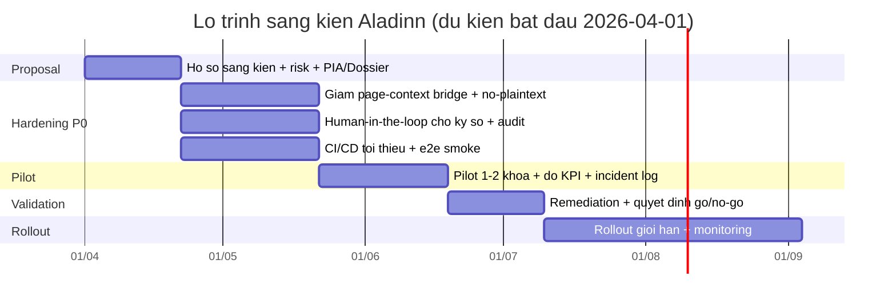

# Báo cáo sáng kiến bệnh viện cấp cơ sở dựa trên Aladinn v1.0.0

## Executive summary

Aladinn v1.0.0 là một **Chrome extension Manifest V3 (MV3)** được thiết kế để “cắm” trực tiếp vào web HIS (domain `*.vncare.vn`) nhằm tăng năng suất nhập liệu và hoàn tất hồ sơ, với ba nhóm chức năng chính: **Scanner hỗ trợ nhập nhanh**, **Voice AI (chuyển giọng nói → nội dung)**, và **Auto-sign (tự động hóa thao tác ký số trên giao diện)**. Trong bối cảnh bệnh viện tuyến cơ sở thường thiếu nhân lực và thời gian, nhóm giải pháp này có thể mang lại lợi ích rõ rệt: giảm thao tác lặp, tăng tốc hoàn thiện bệnh án, tiêu chuẩn hóa đoạn mô tả lâm sàng, và rút ngắn “lead time” từ thăm khám đến phát hành y lệnh/báo cáo.

Tuy nhiên, qua phân tích mã nguồn gói Aladinn v1.0.0 và đối chiếu các chuẩn an toàn – pháp lý tại Việt Nam, dự án hiện ở trạng thái **“hữu ích nhưng rủi ro cao nếu triển khai rộng ngay”**. Rủi ro trọng yếu tập trung vào: (1) **cơ chế tiêm (inject) script vào page context** và cầu nối giao tiếp giữa extension–web HIS (tăng bề mặt tấn công), (2) **quản lý secret/API key chưa “no-plaintext”**, (3) **xử lý dữ liệu y tế và AI bên thứ ba** (nguy cơ chuyển dữ liệu ra ngoài và phát sinh nghĩa vụ đánh giá tác động), và (4) **auto-sign dựa nhiều vào heuristic DOM/text** (nguy cơ ký nhầm/đóng nhầm trong workflow pháp lý). Các yêu cầu pháp lý/chuẩn ngành tại Việt Nam cũng nhấn mạnh phần mềm hồ sơ bệnh án điện tử phải có **xác thực – phân quyền – mã hóa khi liên thông – ghi vết giao dịch (audit trail)** và quy chế chữ ký số trước triển khai. citeturn7view1turn9view0

Khuyến nghị chiến lược cho sáng kiến: **không triển khai “đại trà” theo mô hình extension tự xử lý mọi thứ**, mà chuyển Aladinn thành **thin-client** (UI trợ giúp) và đặt các thành phần nhạy cảm (AI, truy xuất dữ liệu, ký số, audit) vào **gateway nội bộ bệnh viện** có kiểm soát phân quyền/ghi vết. Cách làm này vừa phù hợp yêu cầu kiểm soát truy cập và ghi vết theo quy định hồ sơ bệnh án điện tử, vừa giảm rủi ro bí mật và dữ liệu thoát ra khỏi hệ thống. citeturn7view1turn0search1turn0search2

Top 5 việc cần làm ngay (trước pilot) được đề xuất trong báo cáo gồm: **(i)** siết cầu nối page-context và `web_accessible_resources`; **(ii)** loại bỏ hoàn toàn plaintext secret, thay bằng token ngắn hạn qua gateway; **(iii)** áp “human-in-the-loop” cho ký số + đối soát ngữ cảnh; **(iv)** thiết lập audit trail/telemetry tập trung; **(v)** dựng QA/CI/CD tối thiểu (build reproducible, test e2e, security checks). Các hạng mục còn lại có thể triển khai theo lộ trình 1–6 tháng tùy năng lực. citeturn5search1turn6search0turn6search2turn7view1

## Bối cảnh, mục tiêu, phạm vi và lợi ích–rủi ro

Bệnh viện tuyến cơ sở thường gặp “nút cổ chai” ở khâu nhập liệu, chuẩn hóa nội dung bệnh án, ký số và phát hành chứng từ. Sáng kiến dựa trên Aladinn nhằm tạo **lớp trợ giúp ngay trên trình duyệt** (điểm chạm quen thuộc với bác sĩ) nhưng vẫn cần tuân thủ các yêu cầu pháp lý về hồ sơ bệnh án điện tử (quản lý truy cập, mã hóa liên thông, ghi vết, quy chế chữ ký số…). citeturn7view1turn9view0

Về chuẩn và định hướng, quy định hồ sơ bệnh án điện tử tại Việt Nam nêu rõ yêu cầu hệ thống phải có **xác thực/cấp quyền**, **mã hóa khi trao đổi**, và **ghi vết tất cả giao dịch người dùng**; đồng thời yêu cầu ban hành quy chế chữ ký điện tử/chữ ký số trước triển khai và tham chiếu các tiêu chuẩn như HL7 CDA, HL7 FHIR trong tiêu chuẩn CNTT y tế. citeturn7view1

### Bảng giới thiệu ngắn gọn sáng kiến

| Hạng mục | Nội dung đề xuất cho hồ sơ sáng kiến |
|---|---|
| Mục tiêu | (1) Giảm thời gian nhập liệu và hoàn tất bệnh án; (2) Giảm lỗi thao tác lặp; (3) Tăng tính chuẩn hóa, truy vết và an toàn khi ký số; (4) Tạo nền cho liên thông theo chuẩn. citeturn7view1turn6search2 |
| Phạm vi | Pilot trong 1–2 khoa (ví dụ: Nội tổng quát/Chấn thương chỉnh hình) trên một số loại biểu mẫu chọn lọc; không áp dụng ngay cho toàn viện và không áp dụng cho tất cả chứng từ có giá trị pháp lý cao khi chưa có “human-in-the-loop”. citeturn7view1 |
| Lợi ích cho bác sĩ | Giảm thao tác copy–paste; gợi ý/điền nhanh thông tin từ ngữ cảnh; hỗ trợ giọng nói; giảm thao tác chuyển tab khi ký số. Lợi ích chỉ bền vững nếu có kiểm soát chất lượng và đào tạo. citeturn6search2turn7view1 |
| Lợi ích cho HIS/CNTT | Tạo lớp chuẩn hóa workflow (thông qua gateway): ghi vết tập trung, giảm phụ thuộc vào thay đổi UI, quản trị quyền theo vai trò. citeturn7view1turn6search1turn6search4 |
| Rủi ro hiện tại | (a) Bề mặt tấn công tăng do inject/page-context bridge; (b) Secret/API key chưa “no-plaintext”; (c) Nguy cơ dữ liệu y tế ra bên thứ ba/ra nước ngoài → nghĩa vụ đánh giá tác động; (d) Auto-sign có thể ký nhầm; (e) Thiếu test/CI → khó kiểm soát thay đổi. citeturn5search5turn0search1turn8view3turn7view1turn6search0 |

### Giả định để lập kế hoạch (cần chốt khi nộp sáng kiến)

Báo cáo này giả định Aladinn đang tích hợp vào web HIS của entity["company","VNPT","vietnam telecom group"] và có khả năng gọi dịch vụ AI của entity["company","Google","us tech company"] thông qua API (theo dấu hiệu cấu hình host permission trong mã). Các giả định về hạ tầng gateway, danh mục chứng từ ký số, và mô hình tài khoản/SSO của bệnh viện cần được mô tả rõ trong hồ sơ sáng kiến để hội đồng đánh giá rủi ro đúng thực tế. citeturn7view1turn8view3

## Danh sách điểm yếu theo mức nguy hiểm và kế hoạch sửa

Các rủi ro được xếp theo tiêu chí “tệ nhất có thể xảy ra” trong môi trường bệnh viện: **rò rỉ dữ liệu y tế**, **ký nhầm chứng từ**, **vi phạm yêu cầu ghi vết/phân quyền**, và **gián đoạn vận hành**.

### Bảng tóm tắt các sửa bắt buộc

Bảng dưới đây là “bảng điều hành” để trình hội đồng: ưu tiên, ước lượng công, và rủi ro khi sửa (risk of change). Ước lượng person-days là **sơ bộ**, tính theo 1 person-day ≈ 8 giờ làm việc hiệu quả, chưa gồm thời gian chờ phối hợp HIS/vendor.

| ID | Điểm yếu (từ nguy hiểm nhất) | Nguyên nhân gốc rễ | Tác động chính | Biện pháp sửa cụ thể | Ưu tiên | Ước lượng (person-days) | Rủi ro khi sửa |
|---|---|---|---|---|---|---:|---|
| P0-1 | Page-context bridge + inject script mở rộng bề mặt tấn công | Phải tiêm script để đọc/hook nội bộ HIS; giao tiếp extension–page dựa event/message | Bảo mật + pháp lý (PHI), dễ bị kéo theo nếu có XSS | Giảm tối đa page-context code; chuyển truy xuất dữ liệu/AI/ký số sang gateway; siết `web_accessible_resources`; chuẩn hóa message contract + nonce + origin check; “fail closed” | Ngay | 25–45 | Có thể làm hỏng tích hợp nếu HIS đổi hành vi JS; cần pilot kỹ |
| P0-2 | Secret/API key còn plaintext & nhiều nguồn lưu | Tương thích ngược + fallback chain (storage/localStorage) | Bảo mật + chi phí + khó audit | “No plaintext”: bỏ hoàn toàn plaintext path; không lưu long-lived key trong extension; dùng token ngắn hạn từ gateway; rotation; vault/KMS | Ngay | 12–25 | Có nguy cơ ngừng Voice AI tạm thời nếu gateway chưa sẵn |
| P0-3 | Dữ liệu y tế dùng cho AI bên thứ ba + nguy cơ chuyển dữ liệu ra nước ngoài | Thiết kế gọi AI trực tiếp từ client; thiếu lớp kiểm soát dữ liệu | Pháp lý + bảo mật; nghĩa vụ hồ sơ đánh giá tác động & kiểm soát chuyển dữ liệu | AI Gateway nội bộ: redaction/de-identification, policy engine; hạn chế PHI; logging; DPIA/PIA theo NĐ 13; hợp đồng DPA | Ngay | 20–40 | Rủi ro “scope creep” và tranh luận pháp chế nếu mục tiêu dữ liệu không rõ |
| P0-4 | Auto-sign dựa heuristic DOM/text, có thể ký nhầm | Tự động click nút theo text/selector; thiếu đối soát ngữ cảnh | Lâm sàng + pháp lý + vận hành | Human-in-the-loop: bắt buộc xác nhận (patient encounter id + document hash + loại chứng từ); checklist trước ký; chặn ký khi ngữ cảnh không chắc chắn; audit log | Ngay | 15–30 | Nếu chặn quá chặt có thể giảm lợi ích; cần thiết kế UX cân bằng |
| P0-5 | Thiếu audit trail/telemetry tập trung | Extension thiên về “chạy được” chưa chuẩn hóa log | Tuân thủ + điều tra sự cố + chất lượng | Thiết kế audit chuẩn; lưu tập trung (append-only); mapping sang AuditEvent (FHIR) nếu có; dashboard; cảnh báo | Ngay/1–3 tháng | 10–20 | Thiếu log chuẩn ban đầu; cần thống nhất taxonomy & privacy |
| P1-1 | Message protocol lỏng, thiếu schema validation/versioning | Dùng string action/type rải rác | Sai lệch hành vi khó debug | Định nghĩa schema (JSON Schema/Zod), versioning, contract tests | 1–3 tháng | 8–15 | Cần refactor nhiều module |
| P1-2 | State/storage phân tán, nhiều “source of truth” | Tích lũy từ hợp nhất 3 dự án | Bug khó tái hiện | Chuẩn hóa cấu trúc settings; migrate dữ liệu; “single storage service” | 1–3 tháng | 8–18 | Rủi ro lỗi migration & mất settings |
| P1-3 | Phụ thuộc mạnh selector/UI HIS, dễ gãy khi thay đổi | Automation dựa DOM/jqGrid | Gián đoạn vận hành | Test harness UI; “contract selectors”; fallback graceful; feature flags theo phiên bản HIS | 1–3 tháng | 12–25 | Cần dữ liệu thay đổi UI thật để calibrate |
| P1-4 | Thiếu test/CI/CD & kiểm soát release | Chưa có pipeline, regression tests | Rủi ro phát hành | CI theo SSDF; unit+e2e+security checks; artifact signing; SBOM | 1–3 tháng | 15–35 | Ban đầu tăng chi phí, nhưng giảm rủi ro dài hạn |
| P2-1 | Nuốt lỗi (catch rỗng), hỏng âm thầm | Ưu tiên sự “êm” | Lâm sàng/vận hành | Error handling: phân loại lỗi, telemetry, fail-safe | 3–6 tháng | 5–12 | Lộ nhiều lỗi “ẩn”, cần triage |
| P2-2 | Hiệu năng: observer/polling dày | Thiết kế polling thay vì event-driven | UX xấu, CPU tăng | Event-driven, debounce/throttle, triage observers | 3–6 tháng | 5–15 | Có thể ảnh hưởng timing workflow |
| P2-3 | Source và dist cùng tồn tại, dễ drift | Quy trình build/release chưa “single source” | Sai bản triển khai | Chốt “source-of-truth”; build reproducible; versioning | 3–6 tháng | 2–6 | Tác động thấp |
| P2-4 | Technical debt/legacy compat kéo dài | Nhiều nhánh backward | Khó audit | Kế hoạch “deprecate”; xóa đường cũ theo mốc | 3–6 tháng | 3–10 | Rủi ro người dùng cũ bị ảnh hưởng |

Các thực hành “tối thiểu quyền” (least privilege), hạn chế tài nguyên web-accessible, và cảnh báo rủi ro content script dù có isolated world đều đã được nêu trong hướng dẫn bảo mật extension của Chrome; đây là căn cứ để hội đồng đánh giá rằng các thay đổi P0-1/P0-2 là bắt buộc trước pilot. citeturn5search1turn5search5turn0search0turn0search24

### Phân tích và biện pháp sửa chi tiết theo từng điểm yếu

#### P0-1 Page-context bridge và inject script vào HIS

**Mô tả ngắn:** Aladinn hiện phải inject một số script vào page context để hook hành vi nội bộ (Ajax/jqGrid/API bridge). Cơ chế này làm tăng bề mặt tấn công so với content script isolated world. Ngay cả khi có kiểm tra `origin`, mọi lỗi XSS hoặc script độc hại chạy cùng origin của HIS đều có thể tương tác/giả mạo thông điệp, dẫn đến đọc/ghi dữ liệu vượt ý định.

**Nguyên nhân gốc rễ:** HIS không cung cấp API chính thống/ổn định cho các use-case cần thiết; dự án buộc phải “bám” vào JS/DOM nội bộ. Khi thiếu gateway nội bộ, extension phải gánh vai trò integration layer.

**Tác động:**
- **Bảo mật:** nguy cơ exfiltration dữ liệu y tế, fingerprinting extension khi tài nguyên bị web-accessible. citeturn5search5turn5search9  
- **Pháp lý:** nếu dữ liệu bệnh án bị truy cập trái phép, rủi ro vi phạm nghĩa vụ bảo vệ dữ liệu cá nhân nhạy cảm (sức khỏe). citeturn8view1turn8view3  
- **Vận hành:** HIS thay đổi UI/JS → extension gãy hàng loạt.

**Biện pháp sửa (cụ thể, ưu tiên code-level):**
1. **Giảm tài nguyên web-accessible xuống mức tối thiểu**: chỉ expose đúng file cần thiết, tránh wildcard `injected/*.js`; áp dụng match cụ thể hơn thay vì toàn bộ `*.vncare.vn/*` nếu có thể. citeturn5search5turn0search8  
2. **Thay `window.postMessage` bằng CustomEvent nội bộ DOM khi có thể**, vì `postMessage` là kênh mà mọi script cùng trang có thể nghe; đồng thời khi buộc dùng `postMessage`, phải có **schema validation** + **nonce per-tab** do extension sinh ra. MDN khuyến cáo kiểm tra `origin` và coi dữ liệu nhận là không tin cậy. citeturn5search0turn5search8  
3. **Chuyển chức năng nhạy cảm sang gateway nội bộ** (xem Kiến trúc mục tiêu): dữ liệu/AI/ký số không xử lý ở page-context.  
4. **Thiết kế “fail closed”**: nếu handshake/nonce sai → không xử lý message, không fallback lỏng.

**Ưu tiên:** Ngay (điều kiện tiên quyết trước pilot).

**Ước lượng:** 25–45 person-days (refactor + test + pilot hardening).

**Rủi ro khi sửa:** cao; dễ ảnh hưởng các luồng phụ thuộc vào JS nội bộ HIS. Cần chạy pilot có kiểm soát, rollback nhanh.

#### P0-2 Secret management chưa “no plaintext”

**Mô tả ngắn:** API key còn có đường fallback plaintext và nhiều nơi lưu (chrome storage + localStorage). Điều này làm tăng nguy cơ lộ secret, khó audit và khó chứng minh tuân thủ chính sách bảo mật.

**Nguyên nhân gốc rễ:** thiết kế ưu tiên “đỡ gián đoạn” (fallback khi decrypt fail) và tương thích ngược; thiếu kiến trúc gateway để không cần lưu key ở client.

**Tác động:**  
- **Bảo mật:** key lộ → lạm dụng quota, suy giảm trust, mở cửa cho truy vấn ngoài kiểm soát. OWASP khuyến nghị quản lý secret tập trung, có kiểm soát truy cập/rotate/audit thay vì phân tán. citeturn0search1turn0search5  
- **Pháp lý:** nếu key dẫn đến đường truyền dữ liệu bệnh án ra ngoài không kiểm soát. citeturn8view3  
- **Vận hành:** khi key bị revoke, workflow AI đứt, không có chế độ dự phòng.

**Biện pháp sửa cụ thể:**
1. **Xóa hoàn toàn đường plaintext** trong extension (“no plaintext”), kể cả legacy settings; thay bằng cơ chế token ngắn hạn. OWASP nêu rõ nhu cầu “centralize storage/provisioning/auditing/rotation”. citeturn0search1turn0search5  
2. **Không lưu long-lived key ở extension**: extension chỉ giữ **access token ngắn hạn** (minutes) lấy từ gateway sau khi user đã được xác thực/ủy quyền.  
3. **Key rotation chính sách hóa** theo khuyến nghị quản lý vòng đời khóa của entity["organization","NIST","us standards institute"] (SP 800-57) và ghi vết sử dụng key. citeturn0search2turn0search37  
4. Nếu cần mã hóa tạm thời ở client: phải coi đây là “obfuscation”, không phải biện pháp đủ mạnh trước attacker có quyền trên máy trạm; trọng tâm vẫn là **tách key khỏi client**.

**Ưu tiên:** Ngay.

**Ước lượng:** 12–25 person-days (tùy có/không gateway ngay).

**Rủi ro khi sửa:** trung bình; có thể làm mất Voice AI tạm thời nếu gateway chưa hoàn thiện.

#### P0-3 Rủi ro dữ liệu y tế sang AI bên thứ ba và nghĩa vụ đánh giá tác động

**Mô tả ngắn:** Voice AI/LLM là điểm “nhạy cảm pháp lý” vì dữ liệu sức khỏe thuộc nhóm dữ liệu cá nhân nhạy cảm. Nếu gọi AI service ở ngoài (đặc biệt ngoài lãnh thổ), cần quản trị mục đích, phạm vi, log, thỏa thuận ràng buộc và có thể phải lập hồ sơ đánh giá tác động xử lý và/hoặc chuyển dữ liệu xuyên biên giới.

**Nguyên nhân gốc rễ:** client gọi thẳng AI API, thiếu lớp policy engine/redaction.

**Tác động:**  
- **Pháp lý & tuân thủ:** Nghị định 13 có khung yêu cầu về biện pháp bảo vệ trong xử lý dữ liệu, và nêu cơ chế “Dossier for assessment of the impact” cho xử lý/cross-border transfer. citeturn7view0turn8view1turn8view3  
- **Bảo mật:** khó kiểm soát log, khó kiểm soát prompt/data leakage.  
- **Lâm sàng:** AI có thể sinh nội dung sai/hallucination → nếu không có kiểm tra, chất lượng bệnh án suy giảm.

**Biện pháp sửa cụ thể:**
1. **AI Gateway nội bộ**: mọi yêu cầu AI đi qua gateway trong mạng bệnh viện (hoặc VPC do bệnh viện kiểm soát), nơi thực thi:
   - Data minimization: chỉ gửi dữ liệu cần thiết; ưu tiên thông tin không định danh, hoặc trích xuất cấu trúc thay vì full note.  
   - Redaction/de-identification theo policy: loại bỏ tên, số hồ sơ, số CCCD, địa chỉ…  
   - Rate limit, allowlist model, logging.  
2. **Hồ sơ đánh giá tác động** (PIA/DPIA) và nếu có chuyển dữ liệu xuyên biên giới thì lập hồ sơ đánh giá tác động cross-border transfer với đầy đủ mục tiêu, loại dữ liệu, biện pháp bảo vệ, cơ chế khiếu nại và ràng buộc giữa bên chuyển–bên nhận. citeturn8view3turn8view1  
3. **Hợp đồng & DPA**: quy định mục đích xử lý, retention, quyền kiểm soát dữ liệu, và cơ chế xử lý sự cố.  
4. **Human verification**: AI chỉ “gợi ý”, bác sĩ chịu trách nhiệm duyệt trước khi ghi vào bệnh án; đây là rào an toàn lâm sàng cần nêu trong SOP.

**Ưu tiên:** Ngay (trước pilot nếu có dữ liệu thật).

**Ước lượng:** 20–40 person-days (gateway + PIA + policy).

**Rủi ro khi sửa:** trung bình–cao; dễ vướng pháp chế nếu phạm vi dữ liệu không được giới hạn ngay từ đầu.

#### P0-4 Auto-sign và nguy cơ ký nhầm trong workflow pháp lý

**Mô tả ngắn:** Auto-sign hiện dựa vào quan sát modal/DOM và click nút theo text/selector. Trong môi trường HIS, chỉ cần thay đổi UI nhỏ hoặc popup khác thường cũng có thể dẫn đến click nhầm, đóng nhầm, hoặc ký nhầm.

**Nguyên nhân gốc rễ:** không có API ký số chính thống; automation dựa UI (RPA-like) nên bản chất mong manh.

**Tác động:**  
- **Pháp lý:** chứng từ ký số có giá trị tương đương/sát với chữ ký tay theo khung pháp luật chữ ký số; ứng dụng ký số phải tuân thủ kiểm tra trạng thái chứng thư, quy chuẩn, và quy chế đơn vị. citeturn9view0turn7view1  
- **Lâm sàng:** ký sai bệnh nhân/đợt điều trị → sự cố chuyên môn, khó xử lý hậu kiểm.  
- **Vận hành:** mất niềm tin người dùng, bị “tắt tính năng”.

**Biện pháp sửa cụ thể:**
1. **Human-in-the-loop bắt buộc** ở tầng extension: trước hành động ký, hiển thị overlay xác nhận gồm:
   - Patient ID/Encounter ID/Document type  
   - Hash nội dung (hoặc checksum) và thời điểm  
   - Người ký và chứng thư đang dùng  
   Người dùng phải xác nhận bằng thao tác chủ động (không auto-click).  
2. **Context guardrails**: chỉ cho auto-assist trong các màn hình xác định rõ; nếu phát hiện UI không chắc chắn → chuyển sang chế độ “hỗ trợ” (highlight nút) thay vì click.  
3. **Audit log ký số**: ghi vết ai ký, lúc nào, tài liệu nào, outcome; phù hợp yêu cầu phần mềm EMR phải ghi vết giao dịch người dùng. citeturn7view1turn6search2  
4. **Đối chiếu quy chế chữ ký số của bệnh viện**: Thông tư về bệnh án điện tử yêu cầu thủ trưởng cơ sở phải ban hành quy chế chữ ký điện tử/chữ ký số trước triển khai; quy chế phải mô tả phạm vi chứng từ được ký, ngoại lệ, và khi nào phải ký giấy. citeturn7view1  
5. **Tuân thủ nghĩa vụ kiểm tra chứng thư số** theo khung nghị định về chữ ký số (đặc biệt quy trình kiểm tra trạng thái chứng thư, trách nhiệm của bên phát triển ứng dụng). citeturn9view0turn9view1turn9view2

**Ưu tiên:** Ngay.

**Ước lượng:** 15–30 person-days.

**Rủi ro khi sửa:** trung bình; nếu UX kém sẽ bị bác sĩ “tắt”. Cần thử A/B trong pilot.

#### P0-5 Thiếu audit trail/telemetry tập trung

**Mô tả ngắn:** Nếu không có log/audit chuẩn, bệnh viện khó chứng minh tuân thủ, khó điều tra sự cố (“ai làm gì, lúc nào, trên bệnh nhân nào”), và không đo được hiệu quả sáng kiến.

**Nguyên nhân gốc rễ:** extension-centric, log phân tán, chưa có SIEM/log pipeline.

**Tác động:**  
- **Tuân thủ:** Quy định EMR yêu cầu ghi vết giao dịch và tương tác người dùng (xem/nhập/sửa/hủy/khôi phục) kèm timestamp. citeturn7view1  
- **An toàn & điều tra:** OWASP nhấn mạnh logging là dữ liệu quan trọng cho use-case an ninh và vận hành; thiếu logging là nhóm lỗi điển hình. citeturn6search2turn6search22  
- **Cải tiến:** không có telemetry → không tối ưu được prompt/UX.

**Biện pháp sửa cụ thể:**
1. **Thiết kế taxonomy log** (security, clinical workflow, system errors) và chuẩn hóa event id. citeturn6search2turn6search6  
2. **Pipeline log tập trung** theo playbook quản trị log của NIST (SP 800-92 Rev.1 bản planning guide nêu “playbook” cho cải thiện log management). citeturn6search1turn6search5  
3. **Bám chuẩn y tế nếu có FHIR layer**: dùng mô hình AuditEvent để biểu diễn audit ở mức interoperable (tùy mức trưởng thành). AuditEvent được mô tả là bản ghi sự kiện liên quan vận hành, privacy, security. citeturn1search0

**Ưu tiên:** Ngay/1–3 tháng (tối thiểu phải có trước pilot có dữ liệu thật).

**Ước lượng:** 10–20 person-days.

**Rủi ro khi sửa:** thấp–trung bình; chủ yếu cần thống nhất cách “ẩn danh hóa log”.

#### P1-1 Message protocol thiếu schema validation và versioning

**Mô tả ngắn:** Các message type/action rải rác theo string. Khi mở rộng, nguy cơ lệch hợp đồng message, khó debug.

**Biện pháp sửa cụ thể:** Định nghĩa “messaging contract” có version (v1/v2), schema validation (JSON Schema/Zod), contract tests; coi message như API nội bộ. MDN nhấn mạnh postMessage cần đảm bảo an toàn kiểm tra origin và coi data là không tin cậy, và từ đó triển khai validation/chặn message không đạt chuẩn. citeturn5search0turn5search8

**Ưu tiên:** 1–3 tháng.

**Ước lượng:** 8–15 person-days.

**Rủi ro khi sửa:** trung bình; refactor rộng.

#### P1-2 Storage/state phân tán

**Mô tả ngắn:** Nhiều nơi lưu settings và dữ liệu làm phát sinh “multiple sources of truth”.

**Biện pháp sửa:** Một schema settings duy nhất + migration có version; “write once by service” (StorageService) và “read only via service”; xóa localStorage fallback. OWASP khuyến cáo quản lý secret tập trung; nguyên tắc này mở rộng sang quản lý cấu hình nhạy cảm. citeturn0search1turn0search5

**Ưu tiên:** 1–3 tháng.

**Ước lượng:** 8–18 person-days.

**Rủi ro khi sửa:** trung bình; cần plan rollback khi migration lỗi.

#### P1-3 Phụ thuộc selector/UI HIS, dễ gãy

**Mô tả ngắn:** Các module Automation dựa selector và text; khi HIS cập nhật UI sẽ gãy.

**Biện pháp sửa:** Dựng test harness UI regression (Playwright) + contract selectors; áp feature flag theo phiên bản HIS; thêm cơ chế “soft-fallback” (chỉ highlight, không click). Chỉ số thành công lâm sàng phải đi kèm “tỷ lệ fail-safe đúng”. citeturn6search0turn6search4

**Ưu tiên:** 1–3 tháng.

**Ước lượng:** 12–25 person-days.

**Rủi ro khi sửa:** trung bình; cần mẫu UI thật theo khoa.

#### P1-4 Thiếu test/CI/CD và kiểm soát release

**Mô tả ngắn:** Không có pipeline kiểm thử tự động; rủi ro phát hành cao.

**Biện pháp sửa:** Áp dụng khung SSDF của NIST cho SDLC (chuẩn hóa build, kiểm thử, phản hồi lỗ hổng), kết hợp security scanning và artifacts có thể tái lập. citeturn6search4turn6search0

**Ưu tiên:** 1–3 tháng.

**Ước lượng:** 15–35 person-days.

**Rủi ro khi sửa:** thấp; chủ yếu tăng thời gian ban đầu.

#### P2-1 Nuốt lỗi (silent failure)

**Mô tả ngắn:** catch rỗng làm lỗi bị che; trong y tế, “hỏng âm thầm” nguy hiểm hơn crash rõ ràng.

**Biện pháp sửa:** phân loại lỗi, hiển thị trạng thái, gửi telemetry; thiết kế “fail closed” cho thao tác quan trọng (ký số, ghi bệnh án). OWASP nhấn mạnh logging/monitoring cho sự kiện an ninh và vận hành. citeturn6search2turn6search22

**Ưu tiên:** 3–6 tháng.

**Ước lượng:** 5–12 person-days.

**Rủi ro khi sửa:** thấp; nhưng sẽ “lộ” nhiều lỗi tiềm ẩn.

#### P2-2 Hiệu năng: observer/polling dày

**Biện pháp:** chuyển sang event-driven; throttle/debounce; giảm quan sát toàn trang; chỉ kích hoạt module theo feature flag và theo screen. Chrome khuyến nghị tối thiểu quyền và tối thiểu bề mặt. citeturn5search1turn0search24

**Ưu tiên:** 3–6 tháng.

**Ước lượng:** 5–15 person-days.

**Rủi ro khi sửa:** thấp–trung bình.

#### P2-3 Source–dist drift

**Biện pháp:** “single source of truth” cho build; versioning; artifact build = commit hash; release checklist.

**Ưu tiên:** 3–6 tháng.

**Ước lượng:** 2–6 person-days.

**Rủi ro khi sửa:** thấp.

#### P2-4 Technical debt/legacy compat

**Biện pháp:** kế hoạch deprecate theo mốc; loại bỏ đường fallback sau 1–2 release; viết migration note cho người dùng.

**Ưu tiên:** 3–6 tháng.

**Ước lượng:** 3–10 person-days.

**Rủi ro khi sửa:** trung bình (ảnh hưởng nhóm người dùng cũ).

## Lộ trình triển khai sáng kiến và hồ sơ nộp hội đồng

Lộ trình được thiết kế theo nguyên tắc “an toàn – tuân thủ – đo được hiệu quả”, phù hợp với yêu cầu hệ thống EMR phải có kiểm soát truy cập, mã hóa trao đổi, ghi vết đầy đủ, và quy chế chữ ký số trước triển khai. citeturn7view1

### Checklist hồ sơ/tài liệu cần chuẩn bị khi nộp sáng kiến

Checklist dưới đây nên nộp kèm 1 “one-page summary” và 1 deck 8–10 slide.

- **Mục tiêu – phạm vi – tiêu chí thành công (KPIs)**: thời gian hoàn tất bệnh án, tỷ lệ lỗi nhập, tỷ lệ ký số thành công, thời gian phát hành chứng từ.
- **Mô hình dữ liệu & luồng dữ liệu** (data flow diagram): dữ liệu nào đi qua extension, dữ liệu nào ra gateway, phần nào (nếu có) đi tới AI service.
- **Đánh giá rủi ro**: bảo mật, pháp lý, lâm sàng, vận hành; có hazard log cho auto-sign/AI.
- **Privacy Impact Assessment / Dossier**:
  - Dossier đánh giá tác động xử lý dữ liệu cá nhân (processing impact). citeturn8view1  
  - Nếu có chuyển dữ liệu xuyên biên giới: Dossier đánh giá tác động chuyển dữ liệu và cơ chế nộp/duy trì. citeturn8view3turn8view0
- **Governance**: xác định vai trò data controller/processor; phân công Data Protection Officer (nếu có), chủ nhiệm lâm sàng, đầu mối CNTT.
- **Kế hoạch kiểm thử**: unit + integration + e2e + UI regression + security tests.
- **Kế hoạch triển khai pilot**: đào tạo, SOP, quy tắc bật/tắt tính năng, rollback.
- **Quy chế chữ ký số** của bệnh viện và mapping sang workflow auto-sign/human-in-loop (bắt buộc). citeturn7view1turn9view0
- **Kế hoạch ghi vết/audit**: tối thiểu log các thao tác xem–sửa–ký, phù hợp yêu cầu EMR ghi vết giao dịch. citeturn7view1turn6search2

### Timeline triển khai đề xuất và deliverables

Giả định bắt đầu từ **01/04/2026**, mục tiêu có pilot kiểm soát trong 8–10 tuần và rollout giới hạn trong 6 tháng. Tôi khuyến nghị giữ các mốc “go/no-go” rõ ràng để hội đồng chấp thuận theo giai đoạn.

| Giai đoạn | Thời lượng | Milestone | Deliverables bắt buộc |
|---|---:|---|---|
| Proposal & approval | 2–3 tuần | Phê duyệt phạm vi pilot | One-page + deck; risk register; kiến trúc mục tiêu; kế hoạch PIA/Dossier; kế hoạch test. citeturn8view1turn7view1 |
| Hardening P0 | 4–6 tuần | “Pilot-ready build” | Xong P0-1..P0-4; baseline audit/telemetry; quy chế ký số và SOP pilot; CI tối thiểu theo SSDF. citeturn6search4turn7view1turn5search1 |
| Pilot | 4 tuần | Kết thúc pilot | Báo cáo số liệu: thời gian nhập, sự cố, tỷ lệ fail-safe; báo cáo privacy/security; phân tích UX. citeturn6search2turn7view1 |
| Validation & remediation | 3–4 tuần | Quyết định rollout | Fix các lỗi pilot; hoàn thiện governance; nâng test regression; ký biên bản nghiệm thu pilot. citeturn6search0turn6search4 |
| Rollout giới hạn | 6–10 tuần | Rollout 30–50% khoa mục tiêu | Training mở rộng; dashboard monitoring; runbook sự cố; quy trình cập nhật phiên bản. citeturn6search1turn5search15 |

### Sơ đồ timeline dạng mermaid (Gantt)



### Ước lượng nhân lực và ngân sách sơ bộ

**Giả định đơn giá nhân công (để ước lượng):**
- Dev/QA nội bộ: 4–7 triệu VND/person-day (tùy cơ chế trả công/chi phí cơ hội).
- Dev/vendor chuyên sâu security/extension: 8–15 triệu VND/person-day.
- Pen-test độc lập: gói 150–400 triệu VND tùy phạm vi.  
(Con số này chỉ để lập sơ bộ; bệnh viện cần thay bằng khung chi tiêu thực tế.)

| Hạng mục | Khối lượng ước tính | Chi phí sơ bộ (triệu VND) | Ghi chú |
|---|---:|---:|---|
| Hardening P0 (P0-1..P0-4) | 80–140 person-days | 500–1.500 | Tùy mức “gateway hóa” và phạm vi AI/ký số |
| Audit/telemetry + log pipeline | 25–40 person-days | 150–450 | Bám playbook log management; yêu cầu EMR ghi vết citeturn7view1turn6search1 |
| QA automation + CI/CD | 30–60 person-days | 200–700 | Theo SSDF, kiểm soát build/test/security checks citeturn6search4 |
| Hạ tầng gateway (VM/container + TLS) | 1–2 VM + ops | 50–200 | Có thể dùng hạ tầng sẵn có |
| Đánh giá bảo mật độc lập (khuyến nghị) | 1 gói | 150–400 | Tập trung postMessage/permissions/secret/exfil |
| Đào tạo & triển khai pilot | 2–4 buổi/khoa | 20–60 | SOP + đào tạo sử dụng/incident reporting |
| Dự phòng phát sinh | 10–15% | 100–300 |  |

Tổng sơ bộ: **~1–3 tỷ VND** cho 6 tháng nếu làm nghiêm túc ở mức “bệnh viện có thể bảo vệ trước kiểm tra tuân thủ”, chưa tính chi phí vận hành AI theo lượt dùng.

### Mẫu slide/one-page summary để nộp (khung nội dung)

Một trang (A4 hoặc 1 slide) nên có cấu trúc:
- Vấn đề: thời gian nhập liệu, chậm hoàn tất bệnh án, sai sót thao tác lặp.
- Giải pháp: Aladinn (Scanner + Voice AI + Auto-sign) theo mô hình thin-client + gateway.
- Lợi ích định lượng: giảm X% thời gian nhập; giảm Y% lỗi; tăng Z% hoàn tất trong ngày.
- Rủi ro & cách kiểm soát: no-plaintext secret, human-in-loop ký số, audit trail, PIA.
- Kế hoạch: timeline 6 tháng, pilot 2 khoa, go/no-go.
- Nhu cầu nguồn lực: nhân lực + ngân sách + hỗ trợ CNTT/Hành chính/Pháp chế.

## Kiến trúc mục tiêu và định hướng theo chuẩn EHR quốc tế

### Căn cứ chuẩn hóa (Việt Nam và quốc tế)

Ở Việt Nam, quy định EMR yêu cầu phần mềm có khả năng kiểm soát truy cập, mã hóa khi liên thông/trao đổi, và đặc biệt **ghi vết toàn bộ giao dịch người dùng**; đồng thời yêu cầu quy chế chữ ký số trước triển khai. Điều này định hướng kiến trúc: các thao tác quan trọng không thể chỉ nằm trong “tiện ích trình duyệt” thiếu governance. citeturn7view1turn9view0

Ở mức quốc tế, nhóm khả năng “must-have” cho EHR hiện đại thường xoay quanh: audit trail (AuditEvent), consent management (Consent), CDS integration (CDS Hooks), authentication/authorization theo OAuth2/OIDC (SMART on FHIR), và interoperability qua FHIR. Các đặc tả chính thống mô tả rõ mục đích AuditEvent và Consent, cũng như cơ chế CDS Hooks và SMART App Launch. citeturn1search0turn1search1turn1search2turn1search25

### Kiến trúc đề xuất (thin extension + gateway nội bộ)

Mục tiêu là giảm page-context bridge, đưa các phần nhạy cảm sang vùng kiểm soát của bệnh viện.

```mermaid
flowchart LR
    subgraph Browser["Tram bac si (Chrome)"]
      EXT["Aladinn MV3 Extension\n(UI overlay + scanner + voice capture + sign assist)"]
      HISWEB["Web HIS (vncare.vn)\nDOM/UI"]
      EXT <-- "content script (isolated world)" --> HISWEB
    end

    subgraph HospitalNet["Mang noi bo benh vien"]
      IAM["SSO/IdP\n(OIDC or SAML)"]
      GW["Hospital Integration Gateway\nPolicy + RBAC + Audit + AI Proxy"]
      HISAPI["HIS Core API/DB\n(official API or controlled adapter)"]
      AUD["Audit/Telemetry Store\n(append-only + dashboard)"]
    end

    subgraph External["Ben thu ba (tuy chon)"]
      AI["AI Provider API\n(chi nhan du lieu da giam dinh danh)"]
    end

    EXT -->|Auth code / token| IAM
    EXT -->|REST calls (scoped)\nNo long-lived secrets| GW
    GW --> HISAPI
    GW --> AUD
    GW -->|De-identified prompt| AI
    GW -->|Decision + response + trace| EXT
```

**Giải thích điểm kiểm soát then chốt:**
- **Identity & RBAC** nằm ở gateway/IAM, không nằm ở extension.
- **Audit trail** tập trung; dễ đáp ứng yêu cầu ghi vết của EMR. citeturn7view1turn1search0  
- **AI** chỉ gọi ra ngoài sau khi minimization/redaction và có hồ sơ đánh giá tác động nếu cần. citeturn8view3turn0search1

### Đề xuất tính năng tương lai theo tham chiếu EHR quốc tế

Bảng sau ưu tiên các tính năng giúp Aladinn “tiến hóa” từ tiện ích cá nhân sang thành phần được quản trị trong hệ sinh thái EMR.

| Tính năng tương lai | Lợi ích | Rủi ro | Phụ thuộc kỹ thuật | Ưu tiên |
|---|---|---|---|---|
| Audit trail chuẩn hóa (có thể map AuditEvent) | Điều tra sự cố, tuân thủ, đo hiệu quả | Log chứa dữ liệu nhạy cảm nếu thiết kế kém | Log pipeline + taxonomy + bảo vệ log | Cao citeturn1search0turn6search1turn7view1 |
| RBAC + least privilege | Giảm truy cập vượt phạm vi | Sai cấu hình quyền → gián đoạn | IAM + policy engine | Cao citeturn7view1turn5search1 |
| Consent management | Quản trị đồng thuận chia sẻ dữ liệu | Phức tạp quy trình | Data model + UI + quy định địa phương | Trung bình–cao citeturn1search1 |
| Structured templates | Chuẩn hóa bệnh án, giảm biến thiên | “Over-template” làm giảm ngữ cảnh | Bộ template theo chuyên khoa | Trung bình |
| CDS Hooks integration | CDS tại điểm chăm sóc, có kiểm soát | Nếu CDS sai → rủi ro lâm sàng | Hook client + CDS service + governance | Trung bình–cao citeturn1search2turn1search10 |
| FHIR interoperability layer | Liên thông dễ hơn, chuẩn hóa tài nguyên | Đòi hỏi mapping HIS → FHIR | Gateway + FHIR server/adapter | Trung bình–cao citeturn3search5turn7view1 |
| Digital signature workflow “human-in-loop” | Giảm ký nhầm, tăng pháp lý | Tăng 1 bước xác nhận | Hashing + context check + audit | Cao citeturn9view0turn7view1 |
| Audit & telemetry dashboard | Nhìn được adoption & rủi ro | Privacy nếu log quá sâu | BI/dashboard | Trung bình citeturn6search2turn6search1 |
| Test harness cho thay đổi UI | Giảm downtime do thay đổi DOM | Chi phí duy trì test | Playwright + golden selectors | Cao |
| Cơ chế “break-the-glass” | Kiểm soát truy cập trường hợp nhạy cảm | UX khó, cần audit lý do | IAM + audit + policy | Trung bình |

### Bảng so sánh tiêu chuẩn/tech cần cân nhắc

| Chủ đề | Lựa chọn | Khi phù hợp | Điểm mạnh | Giới hạn | Tham chiếu |
|---|---|---|---|---|---|
| Interoperability | FHIR | API hiện đại, tích hợp app | Resource-based, web-friendly; có cơ chế profile/extension; có tài liệu so sánh với HL7 V2 trong spec | Cần mapping từ HIS legacy | citeturn3search9turn3search5turn3search2 |
| Interoperability | HL7 v2 | Legacy messaging nội bộ | Phổ biến, event-driven, “workhorse” trong nhiều hệ thống | Khó mở rộng chuẩn hóa, thường phụ thuộc site-specific | citeturn3search11turn3search4turn3search1 |
| AuthN/AuthZ | OAuth 2.0/2.1 + OIDC | Mô hình API/gateway, app launch | OAuth: ủy quyền truy cập giới hạn; OIDC: lớp định danh trên OAuth | Cần IdP/AS vận hành tốt | citeturn2search0turn2search2turn2search1 |
| AuthN (SSO) | SAML 2.0 | Doanh nghiệp đã có SAML IdP | Mature trong enterprise SSO | XML-based, nặng cho use-case API client | citeturn2search3turn2search7 |
| Ký số | PKI (chứng thư số) | Mọi chứng từ pháp lý | Cơ sở pháp lý rõ; kiểm tra trạng thái chứng thư là bắt buộc trong quy trình | Nếu automation UI: dễ ký nhầm nếu thiếu guardrails | citeturn9view0turn9view2turn7view1 |

## Kế hoạch QA, CI/CD, monitoring và incident response

### Chiến lược kiểm thử theo lớp

Để vận hành trong bệnh viện, extension phải được coi là **phần mềm tác động workflow lâm sàng**, do đó cần nhiều lớp test:

- **Unit tests**: logic thuần (parsers, validators, settings migration, policy checks).
- **Integration tests**: giả lập HIS API adapter/gateway, mô phỏng response và lỗi.
- **E2E tests**: chạy trên Chromium với extension, mô phỏng các màn hình key của HIS; đặc biệt auto-sign phải có “golden path” và “fail-safe path”.
- **UI regression tests**: snapshot DOM/visual (khi hợp lý) để phát hiện thay đổi selector.
- **Security tests**: kiểm tra permissions, web_accessible_resources, postMessage hardening, secret scan, dependency scan.
- **Operational tests**: test mất mạng, HIS chậm, tab crash, service worker restart.

NIST SSDF cung cấp khung thực hành SDLC an toàn để đưa các kiểm thử này vào pipeline một cách có hệ thống. citeturn6search4turn6search0

### Công cụ automation gợi ý (thực dụng cho MV3)

- Unit/integration: Vitest/Jest (tùy stack), MSW cho mock network.
- E2E/UI: Playwright (hỗ trợ Chromium), kịch bản theo khoa.
- Static & security: ESLint, dependency scanning, secret scanning, SAST (CodeQL nếu dùng GitHub).
- Artifact: build reproducible + checksum + ký nội bộ gói phát hành.

### Checklist pre-deploy (trước pilot và trước rollout)

Checklist nên được ký xác nhận bởi CNTT + đại diện khoa + an toàn thông tin:

- Permissions: tối thiểu quyền; host permissions chỉ đúng domain cần thiết. citeturn5search1turn0search16  
- web_accessible_resources: tối thiểu, không wildcard. citeturn5search5turn0search8  
- Secrets: không plaintext; token ngắn hạn; rotation policy. citeturn0search1turn0search2  
- Auto-sign: bật “human-in-loop”, có context check, có audit log. citeturn7view1turn9view0  
- Logging: có log pipeline và retention policy; không log PHI thô. citeturn6search1turn6search2  
- PIA/Dossier: hoàn tất theo NĐ 13 nếu có xử lý/chuyển dữ liệu nhạy cảm. citeturn8view1turn8view3  
- Rollback: có nút tắt module theo feature flag và hướng dẫn gỡ cài.

### Monitoring và incident response

Khuyến nghị dùng khung incident response cập nhật. NIST SP 800-61 Rev 2 đã bị rút/archived (2025) và có Rev 3 (2025) nêu khuyến cáo mới theo hướng quản trị rủi ro; bệnh viện nên viện dẫn phiên bản cập nhật khi xây runbook. citeturn5search3turn5search15

Monitoring tối thiểu cần có:
- Số lượt dùng theo module (scanner/voice/sign)
- Tỷ lệ lỗi theo màn hình HIS và theo phiên bản
- Cảnh báo hành vi bất thường: quá nhiều yêu cầu AI, lỗi ký số tăng, message reject tăng
- Audit truy cập dữ liệu nhạy cảm và thao tác ký số (append-only)

NIST cũng có hướng dẫn playbook cho log management để định hình chương trình nâng cao logging theo thời gian. citeturn6search1turn6search5

## Chính sách bảo mật, quản lý secret, và phụ lục mẫu

### Chính sách bảo mật và quản lý secret đề xuất

Chính sách nên được ban hành như một phụ lục của đề án/pilot, dựa trên các nguyên tắc OWASP và khuyến nghị vòng đời khóa của NIST:

1. **No plaintext**: không lưu API key/secret dạng plaintext ở client; không có fallback plaintext. citeturn0search1turn0search5  
2. **Token ngắn hạn + least privilege**: extension chỉ dùng access token ngắn hạn, có scope theo vai trò và ngữ cảnh. OAuth mô tả mục tiêu cấp quyền truy cập giới hạn. citeturn2search0turn5search1  
3. **Centralized secret store**: secret nằm trong vault/KMS/HSM hoặc dịch vụ quản trị khóa nội bộ; có rotation và audit. citeturn0search1turn0search2  
4. **Key rotation & lifecycle**: định nghĩa cryptoperiod, quy trình thu hồi/zeroization, và ghi vết sử dụng khóa theo SP 800-57. citeturn0search2turn0search37  
5. **Audit logs có integrity controls**: log giao dịch quan trọng phải có kiểm soát chống sửa/xóa; OWASP nêu yêu cầu audit trail cho giao dịch giá trị cao. citeturn6search22turn6search2  
6. **Data minimization & cross-border governance**: nếu có chuyển dữ liệu xuyên biên giới, phải lập dossier đánh giá tác động, mô tả loại dữ liệu, mục tiêu, biện pháp bảo vệ và ràng buộc trách nhiệm. citeturn8view3turn8view0

### Phụ lục mẫu SOP triển khai pilot (rút gọn)

**Mục tiêu SOP:** triển khai có kiểm soát, đảm bảo tắt nhanh khi có sự cố.

1. **Chuẩn bị**
   - Danh sách máy trạm pilot, danh sách tài khoản bác sĩ tham gia.
   - Xác nhận quy chế chữ ký số và danh mục chứng từ được phép dùng “sign assist”. citeturn7view1  
2. **Cài đặt**
   - Cài extension từ nguồn nội bộ (không dùng bản trôi nổi).
   - Bật feature flags theo khoa (scanner/voice/sign).
3. **Đào tạo**
   - 45–60 phút/khoa: quy trình chuẩn + tình huống sai (fail-safe).
   - Nhấn mạnh: AI chỉ gợi ý, phải duyệt; ký số phải xác nhận ngữ cảnh.
4. **Vận hành**
   - Có kênh báo sự cố (hotline CNTT) + form mô tả.
   - Thu thập KPI hàng tuần (thời gian nhập, tỷ lệ lỗi, cảnh báo).
5. **Rollback**
   - Nút tắt module từ xa (feature flag) hoặc hướng dẫn gỡ cài trong 2 phút.
6. **Kết thúc pilot**
   - Báo cáo hội đồng: KPI, sự cố, đánh giá privacy/security, đề xuất go/no-go.

### Phụ lục mẫu “consent/acknowledgement” cho bác sĩ tham gia pilot

**Mục đích:** ghi nhận bác sĩ hiểu rõ giới hạn và trách nhiệm khi dùng công cụ hỗ trợ.

Nội dung mẫu (tóm tắt):
- Tôi tham gia pilot tự nguyện, hiểu đây là công cụ hỗ trợ nhập liệu/ký số có kiểm soát.
- Tôi hiểu dữ liệu bệnh án là nhạy cảm; tôi chỉ sử dụng công cụ đúng mục đích chuyên môn và theo quy chế bệnh viện. citeturn7view1turn8view1  
- Tôi chịu trách nhiệm kiểm tra nội dung do Voice AI gợi ý trước khi lưu.
- Tôi chỉ thực hiện ký số khi đã xác nhận đúng bệnh nhân/đợt điều trị/chứng từ.
- Tôi sẽ báo cáo ngay khi phát hiện hành vi bất thường/sai lệch.

### Phụ lục checklist đánh giá rủi ro bảo mật (dùng khi nghiệm thu pilot)

Checklist “đạt/không đạt”:
- [ ] Không có plaintext secret trên máy trạm (scan cấu hình). citeturn0search1  
- [ ] Permissions tối thiểu (host permissions đúng phạm vi). citeturn5search1  
- [ ] web_accessible_resources không wildcard, match cụ thể. citeturn5search5  
- [ ] postMessage listener có origin check + schema validation + nonce. citeturn5search0turn5search8  
- [ ] Audit trail đầy đủ cho thao tác xem/sửa/ký; log lưu tập trung và có integrity controls. citeturn7view1turn6search22  
- [ ] Hồ sơ DPIA/Dossier hợp lệ nếu có AI/cross-border transfer. citeturn8view1turn8view3  
- [ ] Quy chế chữ ký số đã ban hành và mapping sang workflow tool. citeturn7view1turn9view0  
- [ ] Runbook sự cố và kênh báo cáo hoạt động; tham chiếu hướng dẫn incident response mới. citeturn5search15  

### Kết luận và khuyến nghị rõ ràng

**Khuyến nghị làm ngay (Top 5, “go/no-go” trước pilot):**
1. **Hardening cầu nối extension–HIS**: giảm page-context bridge, siết `web_accessible_resources`, message contract có validation/nonce, fail closed. citeturn5search5turn5search0turn5search1  
2. **Chính sách secret “no plaintext”**: bỏ mọi fallback plaintext; đưa secret ra khỏi client; token ngắn hạn qua gateway; rotation theo NIST. citeturn0search1turn0search2  
3. **AI governance**: AI gateway nội bộ + minimization/redaction; hoàn tất Dossier đánh giá tác động xử lý/chuyển dữ liệu nếu có. citeturn8view1turn8view3  
4. **Auto-sign chuyển sang “human-in-the-loop”**: xác nhận ngữ cảnh + audit log; đối chiếu quy chế chữ ký số và nghĩa vụ kiểm tra chứng thư. citeturn7view1turn9view0turn9view2  
5. **Thiết lập audit/telemetry + QA/CI tối thiểu**: log tập trung theo playbook; e2e smoke tests; SSDF-based pipeline. citeturn6search1turn6search4turn1search0  

**Có thể lùi sau (1–6 tháng) nếu pilot kiểm soát tốt:**
- Tối ưu hiệu năng polling/observer; dọn technical debt/legacy đường cũ.
- Chuẩn hóa sâu interoperability (FHIR facade hoàn chỉnh), CDS Hooks, consent management mở rộng.

Với cách tiếp cận “thin extension + gateway + audit + human-in-loop”, sáng kiến có thể đạt mục tiêu tăng năng suất cho bác sĩ tuyến cơ sở mà vẫn đáp ứng yêu cầu kiểm soát truy cập, ghi vết, chữ ký số và nghĩa vụ đánh giá tác động dữ liệu trong bối cảnh pháp lý hiện hành. citeturn7view1turn8view3turn6search4turn5search1