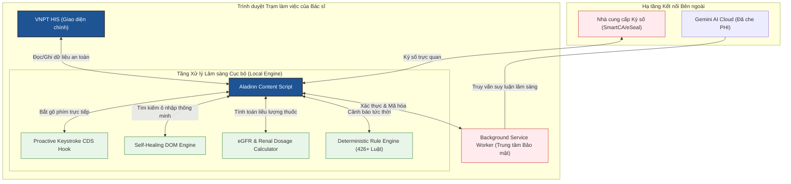

# 🗺️ Kiến Trúc Hệ Thống Aladinn v2 (Clinical OS)

Tài liệu này mô tả chi tiết cách thiết kế và cấu trúc hoạt động của **Aladinn v2** - Trợ lý Lâm sàng AI cho VNPT HIS. Mục tiêu của kiến trúc này là chuyển đổi Aladinn từ một công cụ bổ trợ thông thường thành một **Hệ điều hành Lâm sàng Thu nhỏ (Clinical OS)** chạy trực tiếp, an toàn và thông minh ngay trong trình duyệt của bác sĩ.

---

## 1. Sơ đồ Hoạt động Tổng thể

Dưới đây là mô hình trao đổi dữ liệu an toàn giữa các thành phần cốt lõi của Aladinn v2 và hệ thống VNPT HIS:

---

## 2. 3 Phân Tầng Kỹ Thuật Cốt Lõi

Kiến trúc Aladinn v2 được phân tách thành 3 tầng chức năng độc lập, tuân thủ nguyên tắc **Trách nhiệm Đơn nhất (Single Responsibility)** và **Bảo toàn Dữ liệu (Immutability)**:

### 2.1. Tầng Giao Diện Thích Ứng (Ambient Adaptive UI)
- **Tập tin liên quan:** `content/scanner/scanner-init.js`, `content/cds/ui.js`, `content/voice/ui.js`
- **Nhiệm vụ:**
  - Hiển thị bảng Dashboard Cận lâm sàng phẳng chuẩn HIS, tối giản, vuông vức 100%.
  - Tích hợp hiệu ứng Kính mờ (Glassmorphism) sang trọng để bác sĩ dễ quan sát mà không làm mờ thông tin gốc của HIS.
  - Phản hồi nhanh (Haptic feedback/micro-animations) khi bác sĩ thao tác, rê chuột dóng hàng.

### 2.2. Tầng Bảo Mật và Xác Thực (Safety & Security Guard)
- **Tập tin liên quan:** `content/scanner/patient-context-guard.js`, `background/ai-client.js`, `background/phi-redactor.js`
- **Nhiệm vụ:**
  - **Khóa kép Bệnh nhân (Double-Lock Context):** Theo dõi mã bệnh án (`benhnhanId` và `khambenhId`). Chặn đứng mọi lệnh điền dữ liệu (Auto-fill) nếu bác sĩ chuyển sang bệnh nhân khác trong lúc AI đang phân tích.
  - **Khử định danh PHI:** Tự động lọc sạch tên tuổi, địa chỉ, số điện thoại của bệnh nhân trước khi gửi lên Cloud AI.
  - **Background Authority:** Mã hóa và lưu trữ API Key bằng chuẩn AES-GCM 256-bit cục bộ, không lưu trữ dưới dạng văn bản thường trong bộ nhớ content script.

### 2.3. Tầng Đưa Ra Quyết Định Lâm Sàng Cục Bộ (Local Decision Engine)
- **Tập tin liên quan:** `content/cds/engine.js`, `content/cds/egfr-alerts.js`, `content/shared/self-healing.js`
- **Nhiệm vụ:**
  - **Tự động tìm kiếm thông minh (Self-Healing DOM):** Tự động ánh xạ các trường bệnh lịch bằng phân tích ngữ nghĩa nhãn tiếng Việt lân cận, không bị hỏng khi phần mềm HIS thay đổi giao diện.
  - **Keystroke Hook:** Bắt từ khóa tên thuốc ngay khi bác sĩ đang gõ phím kê đơn để cảnh báo tương tác thuốc và liều lượng theo chức năng thận (eGFR) ngay lập tức.
  - **Rule-based CDS:** Áp dụng bộ 426 luật lâm sàng viết sẵn cứng, hoạt động 100% ngoại tuyến (offline) không cần internet.

---

## 3. Lợi Ích Lâm Sàng Cho Bác Sĩ

1. **Tin Cậy Tuyệt Đối (Safety First):** Không bao giờ có hiện tượng "lấy râu ông nọ cắm cằm bà kia" - thông tin bệnh nhân A điền vào bệnh án bệnh nhân B luôn bị chặn cứng bởi chốt chặn an toàn `PatientContextGuard`.
2. **Tiết Kiệm Thời Gian:** Tính năng quét phím chủ động giúp bác sĩ phát hiện ngay tương tác thuốc nguy hiểm ngay khi gõ tên thuốc, không cần đợi lưu đơn hay chờ AI phân tích từ đầu.
3. **Chống Hỏng Tiện Ích (Zero Maintenance):** Cơ chế Self-Healing DOM tự động thích ứng với các nâng cấp giao diện định kỳ của VNPT HIS, đảm bảo tiện ích hoạt động ổn định quanh năm suốt tháng mà không cần cập nhật code liên tục.
