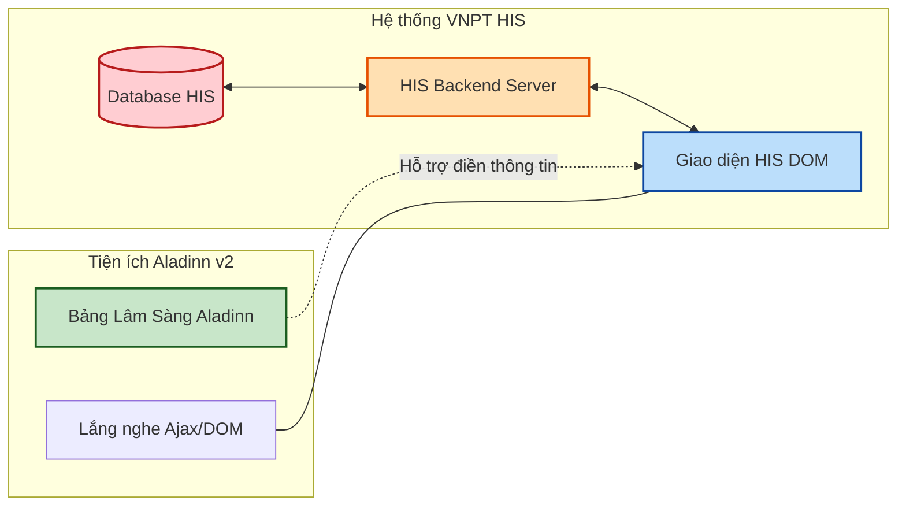

# 🤝 Quy Tắc Tích Hợp An Toàn & Phân Định Ranh Giới VNPT HIS (Aladinn v2)

Tài liệu này xác định rõ ranh giới kỹ thuật và quy tắc tương tác giữa tiện ích **Aladinn v2** và hệ thống thông tin bệnh viện **VNPT HIS**. Đây là cẩm nang bắt buộc để đảm bảo sự ổn định của hệ thống bệnh viện và tuân thủ các quy định pháp lý về CNTT y tế.

---

## 1. Nguyên Tắc Vàng: "Không Xâm Lấn & Không Thay Thế"

Aladinn v2 được thiết kế như một **Trợ lý Ambient (Trợ lý đồng hành)**. Nó hoạt động hoàn toàn ở tầng giao diện người dùng (Client-side) trong trình duyệt của bác sĩ và tuân thủ tuyệt đối quy tắc: **Không bao giờ bypass hoặc can thiệp trực tiếp vào database backend hay business logic cốt lõi của VNPT HIS**.

---

## 2. Quy Tắc Tương Tác DOM & UI (DOM Interaction Boundary)

Để tránh làm hỏng hoặc làm chậm giao diện làm việc gốc của bác sĩ trên HIS:
1. **Không can thiệp vào CSS gốc:** Toàn bộ CSS của Aladinn phải được cô lập thông qua CSS scoping nghiêm ngặt (`.aladinn-` prefix). Tuyệt đối không thay đổi layout mặc định của HIS để tránh làm lệch các nút bấm chuyên môn.
2. **Không chặn Sự kiện Mặc định (Event Bubbling):** Aladinn lắng nghe các sự kiện gõ phím (`keyup`) và click chuột (`click`) nhưng **không bao giờ sử dụng `event.preventDefault()` hoặc `event.stopPropagation()`** đối với các hành động gốc của HIS, ngoại trừ các phím tắt do bác sĩ chủ động cấu hình riêng cho Aladinn.
3. **Đọc dữ liệu thụ động:** Aladinn thu thập kết quả xét nghiệm, lịch sử bệnh và chẩn đoán bằng cách đọc DOM tĩnh đã tải hoặc lắng nghe dữ liệu trả về từ API của trạm làm việc, đảm bảo không tạo thêm bất kỳ truy vấn dư thừa nào lên server HIS.

---

## 3. Quy Định An Toàn Đối Với API Bridge & Lắng Nghe Mạng (Network Snooping)

Aladinn sử dụng các module `ajax-interceptor.js` và `api-bridge.js` để đồng bộ ngữ cảnh bệnh nhân. Quy tắc an toàn bắt buộc:
- **Tuyệt đối KHÔNG giả mạo Request:** Aladinn chỉ lắng nghe (Read-only snoop) các gói tin trả về từ server HIS khi bác sĩ thao tác tự nhiên. Nghiêm cấm việc tự động tạo hoặc gửi các request POST/PUT trực tiếp lên API của HIS mà không qua giao diện tương tác của bác sĩ.
- **Tôn trọng Quyền hạn Đăng nhập:** Aladinn không có quyền hạn riêng. Nó hoàn toàn hoạt động dưới danh nghĩa và giới hạn tài khoản VNPT HIS đang đăng nhập của bác sĩ. Nếu tài khoản của bác sĩ không có quyền kê đơn hoặc ký số, Aladinn cũng sẽ bị chặn hoàn toàn bởi cơ chế bảo mật của HIS.
- **Fail Closed khi mất kết nối nội bộ:** Nếu API Bridge phát hiện sự không đồng bộ giữa dữ liệu mạng (Network response) và dữ liệu hiển thị trên màn hình, Aladinn sẽ tự động xóa sạch cache lâm sàng và tạm dừng hoạt động cho đến khi trang được tải lại.

---

## 4. Phân Định Trách Nhiệm Pháp Lý Lâm Sàng (Clinical Responsibility Matrix)

Aladinn v2 chỉ đóng vai trò hỗ trợ và tối ưu hóa thao tác. Quyền quyết định chuyên môn và trách nhiệm pháp lý cuối cùng luôn thuộc về bác sĩ:

| Chức Năng Của Aladinn | Vai Trò Hỗ Trợ | Giới Hạn & Trách Nhiệm Của Bác Sĩ |
| :--- | :--- | :--- |
| **Tóm Tắt Bệnh Án AI** | Trích xuất và dịch các chỉ số cận lâm sàng bất thường từ bảng kết quả thô sang ngôn ngữ lâm sàng dễ đọc. | **Bắt buộc kiểm tra lại:** Bác sĩ phải đối chiếu bảng tóm tắt với kết quả gốc trên HIS trước khi lưu hồ sơ. |
| **Tính toán eGFR & Cảnh báo liều** | Đưa ra gợi ý về mức độ suy thận và cảnh báo nếu có thuốc kê quá liều khuyến cáo. | **Chỉ mang tính tham khảo:** Bác sĩ cần dựa trên thể trạng lâm sàng thực tế của bệnh nhân để quyết định liều lượng cuối cùng. |
| **Gợi ý Điền nhanh (Auto-fill)** | Tự động điền các mẫu bệnh lịch (bệnh sử, khám lâm sàng) từ ghi chú thô của bác sĩ. | **Xem lại trước khi Lưu:** Thông tin điền tự động phải được bác sĩ đọc lại, chỉnh sửa nếu cần và chủ động ấn nút "Lưu" trên HIS. |
| **Ký Số Đơn Thuốc** | Hỗ trợ hiển thị nhanh nút ký số tích hợp SmartCA để giảm thao tác click chuột. | **Chốt chặn kiểm duyệt:** Bác sĩ chỉ thực hiện ký số khi trực quan xác nhận đơn thuốc hoàn toàn chính xác. |

---

## 5. Quy Trình Duyệt Nâng Cấp (Change Management)

Bất kỳ thay đổi nào liên quan đến cách Aladinn đọc/ghi dữ liệu vào các ô nhập liệu của VNPT HIS đều phải:
1. Trải qua bài test tự động giả lập DOM (`Self-Healing DOM integration test`).
2. Được kiểm thử thủ công trên môi trường HIS sandbox hoặc tài khoản bác sĩ thử nghiệm.
3. Đánh giá tác động blast radius thông qua công cụ phân tích call-graph `gitnexus` để đảm bảo không ảnh hưởng đến các module an toàn y tế khác.
