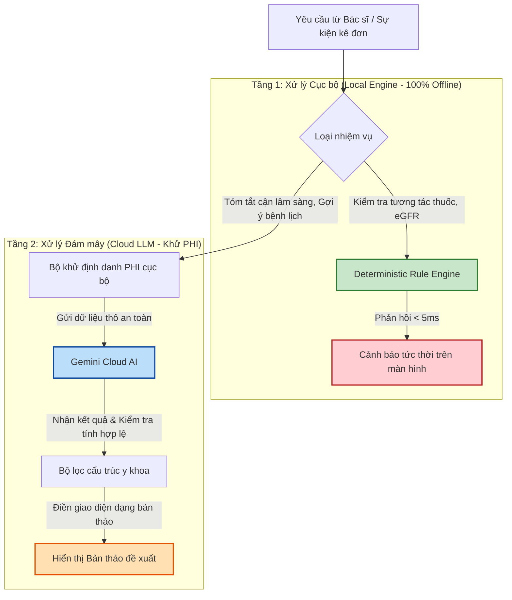

# 🤖 Chính Sách Sử Dụng & Phân Luồng Trí Tuệ Nhân Tạo AI (Aladinn v2)

Trí tuệ nhân tạo (AI) trong **Aladinn v2** được thiết kế để phục vụ như một bộ não bổ trợ, giúp bác sĩ giảm tải các công việc hành chính lặp đi lặp lại và tăng cường an toàn điều trị. Tài liệu này quy định rõ chính sách an toàn lâm sàng, ranh giới đạo đức y sinh và kiến trúc phân luồng xử lý AI của hệ thống.

---

## 1. Tuyên Ngôn Đạo Đức AI Lâm Sàng (AI Ethical Principles)

1. **Bác sĩ là Người Quyết Định Cuối Cùng (Clinician-in-the-Loop):** AI chỉ đưa ra đề xuất, gợi ý hoặc tóm tắt. Quyền quyết định chuyên môn và trách nhiệm pháp lý đối với sức khỏe bệnh nhân luôn thuộc về bác sĩ điều trị.
2. **Nghiêm cấm Tự động hóa Hoàn toàn (Strictly No Auto-Writeback):** Aladinn tuyệt đối không bao giờ tự động lưu bệnh án, tự động kê đơn hoặc tự động gửi lệnh ký số lên server HIS mà không có sự kiểm duyệt trực quan và hành động nhấp chuột thủ công của bác sĩ.
3. **Phòng ngừa Ảo giác AI (Hallucination Defense):** Tất cả các câu trả lời hoặc dữ liệu điền tự động do AI tạo ra đều phải được trình bày rõ ràng dưới dạng "Bản thảo đề xuất" để bác sĩ đọc lại và phê duyệt trước khi ghi nhận chính thức.

---

## 2. Luồng Xử Lý Phân Tầng Thông Minh (Hybrid AI Pipeline)

Để đảm bảo hiệu năng tối đa (phản hồi tức thì) và tính bảo mật cao, Aladinn v2 phân luồng xử lý thành hai tầng riêng biệt:

### 2.1. Tầng Xử Lý Cục Bộ Ngoại Tuyến (Offline Local Engine)
- **Tác vụ áp dụng:** Tính toán eGFR, kiểm tra tương tác giữa các loại thuốc đang kê, rà soát khoảng liều dựa trên tuổi tác/chức năng thận, đối chiếu mã chẩn đoán ICD-10 phù hợp quy định BHYT.
- **Độ trễ:** **< 5ms** (tức thời).
- **Cơ chế:** Chạy 100% offline trên trình duyệt của bác sĩ thông qua bộ 426 quy tắc lâm sàng cứng được biên soạn sẵn từ phác đồ điều trị của Bộ Y tế. Không cần kết nối internet, không gửi bất kỳ dữ liệu nào ra ngoài.

### 2.2. Tầng Suy Luận Đám Mây (Cloud LLM - Gemini Engine)
- **Tác vụ áp dụng:** Dịch và phân tích các chỉ số xét nghiệm phức tạp từ tiếng Anh/viết tắt sang tiếng Việt chuẩn y khoa, tóm tắt diễn biến bệnh sử dài ngày, gợi ý cấu trúc mô tả triệu chứng lâm sàng từ ghi chú thô của bác sĩ.
- **Cơ chế an toàn:**
  - Bắt buộc đi qua bộ lọc khử PHI cục bộ trước khi truyền đi.
  - Sử dụng API doanh nghiệp với cam kết bảo mật không sử dụng dữ liệu để huấn luyện mô hình.
  - **Fail Closed trên dữ liệu lỗi:** Nếu kết quả trả về từ Cloud bị mất cấu trúc (malformed) hoặc chứa các suy luận mâu thuẫn lâm sàng rõ rệt, hệ thống sẽ tự động hủy lệnh điền và yêu cầu bác sĩ nhập thủ công để bảo vệ bệnh nhân.

---

## 3. Hướng Dẫn Bác Sĩ Cộng Tác Với AI (Co-Pilot Checklist)

Khi sử dụng tính năng hỗ trợ AI của Aladinn, bác sĩ nên tuân thủ quy trình 3 bước:
1. **Quét nhanh (Scan):** Nhìn các cảnh báo màu đỏ (mức độ nguy hiểm cao) hoặc màu hổ phách (mức độ trung bình) hiển thị trên góc màn hình để phát hiện lỗi kê đơn ngay khi gõ.
2. **Kiểm duyệt (Review):** Khi sử dụng tính năng "Tự điền nhanh", hãy đọc lướt qua đoạn văn bản AI vừa gợi ý để đảm bảo cấu trúc bệnh lý hoàn toàn đúng với ca bệnh hiện tại.
3. **Phê duyệt (Approve):** Thực hiện nhấn nút "Lưu" trên VNPT HIS bằng tay để chính thức ghi nhận bệnh án vào hệ thống bệnh viện.
