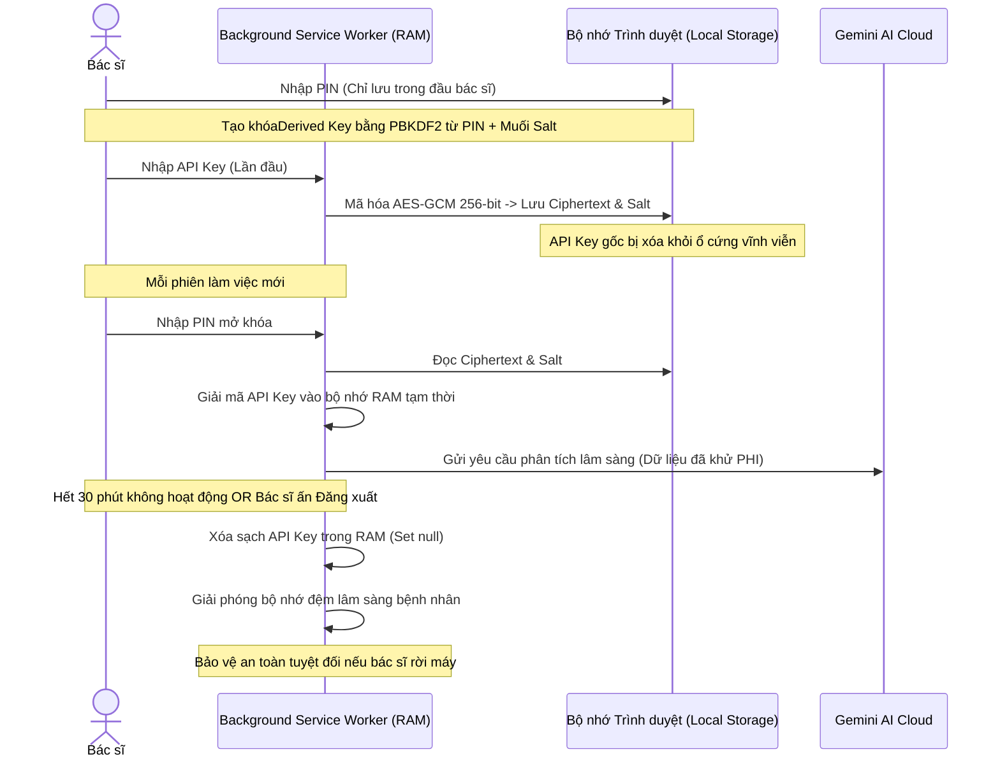

# 🔒 Mô Hình Bảo Vệ Quyền Riêng Tư Y Tế & Mã Hóa Dữ Liệu (Aladinn v2)

Bảo mật thông tin sức khỏe của bệnh nhân (PHI) và thông tin xác thực của bác sĩ là ưu tiên hàng đầu của **Aladinn v2**. Tài liệu này mô tả chi tiết kiến trúc an toàn thông tin, cơ chế mã hóa đầu cuối AES-GCM 256-bit và chính sách bảo vệ dữ liệu tuyệt đối của hệ thống.

---

## 1. Kiến Trúc Bảo Mật Trạm Làm Việc (Workstation Security Lifecycle)

Aladinn v2 áp dụng nguyên tắc **Zero Trust (Không tin cậy bất kỳ ai)** trên trạm làm việc dùng chung tại bệnh viện (nơi nhiều bác sĩ dùng chung một máy tính):

---

## 2. Công Nghệ Mã Hóa Cốt Lõi (Cryptographic Engine)

Aladinn v2 sử dụng thư viện mật mã Web Crypto API tích hợp sẵn trong trình duyệt để thực hiện các thao tác mã hóa hiệu năng cao và an toàn tuyệt đối:

### 2.1. Phái sinh khóa từ PIN (`PBKDF2`)
- **Mục đích:** Chuyển đổi mã PIN đơn giản của bác sĩ thành một khóa mã hóa cực mạnh có độ dài 256-bit.
- **Tham số:** Sử dụng thuật toán băm SHA-256, thực hiện lặp băm 310,000 vòng cùng với một chuỗi muối ngẫu nhiên (`Salt`) dài 16-byte độc nhất cho mỗi máy tính. Điều này ngăn chặn hoàn toàn các cuộc tấn công dò mật khẩu bằng bảng tra sẵn (Rainbow Table).

### 2.2. Mã hóa đối xứng (`AES-GCM 256-bit`)
- **Mục đích:** Bảo vệ API Key của bác sĩ khi lưu trữ trên ổ cứng trạm làm việc.
- **Đặc tính:** GCM (Galois/Counter Mode) không chỉ mã hóa dữ liệu mà còn cung cấp tính năng **Xác thực toàn vẹn dữ liệu (Authenticated Encryption)**. Nếu tệp tin lưu trữ bị sửa đổi dù chỉ 1 bit, quá trình giải mã sẽ báo lỗi ngay lập tức và từ chối hoạt động để ngăn chặn mã độc tiêm nhiễm.

---

## 3. Quy Trình Khử Định Danh Lâm Sàng Cục Bộ (Local PHI Redaction)

Trước khi bất kỳ dữ liệu bệnh án nào được gửi lên các mô hình ngôn ngữ lớn (LLM) trên đám mây để phân tích, Aladinn v2 bắt buộc phải chạy qua bộ lọc **`PHIRedactor`** cục bộ ngay trên trình duyệt:

1. **Nhận diện dữ liệu nhạy cảm (PHI):**
   - **Tên bệnh nhân:** Tự động phát hiện các cụm từ chỉ họ tên tiếng Việt (ví dụ: NGUYỄN VĂN A, TRẦN THỊ B) dựa trên cấu trúc ngữ pháp và chữ in hoa.
   - **Thông tin liên lạc:** Số điện thoại (di động, bàn), địa chỉ email.
   - **Định danh hành chính:** Số CMT/CCCD, Số thẻ BHYT, Mã số bệnh nhân nội bộ, Địa chỉ chi tiết (Số nhà, Tên đường).
2. **Khử định danh (Redaction):**
   - Thay thế toàn bộ thông tin nhạy cảm bằng các nhãn giả lập trung tính. 
     - *Ví dụ gốc:* "Bệnh nhân NGUYỄN VĂN A, 45 tuổi, số BHYT GD479..., trú tại 123 Nguyễn Trãi, Thanh Xuân, Hà Nội vào viện vì đau ngực."
     - *Sau khi xử lý:* "Bệnh nhân [TÊN_BN], 45 tuổi, số BHYT [BHYT_REDACTED], trú tại [ĐỊA_CHỈ_REDACTED] vào viện vì đau ngực."
3. **Bảo toàn dữ liệu lâm sàng:**
   - Các chỉ số xét nghiệm (Creatinine: 120 umol/l), chẩn đoán ICD-10 (I20 - Đau thắt ngực), triệu chứng lâm sàng và tiền sử bệnh hoàn toàn được giữ nguyên vẹn để đảm bảo AI có đủ thông tin đưa ra gợi ý chuẩn xác nhất.

---

## 4. Chế Độ Tự Hủy Bộ Nhớ Phiên (Auto-Purge & Session Timeout)

Để đối phó với môi trường phòng khám bận rộn nơi bác sĩ thường xuyên phải rời máy đột xuất để xử lý ca cấp cứu:
- **Hết hạn phiên tự động (Session Timeout):** Hệ thống sẽ giám sát hoạt động của bác sĩ trên trình duyệt. Nếu không có thao tác chuột hoặc bàn phím nào trong vòng **30 phút**, Aladinn sẽ tự động kích hoạt lệnh tự hủy thông tin mở khóa trong RAM. Bác sĩ bắt buộc phải nhập lại mã PIN để tiếp tục sử dụng.
- **Xóa cache tức thì khi Logout:** Khi bác sĩ click nút "Đăng xuất" trên VNPT HIS hoặc trên bảng điều khiển Aladinn, hệ thống sẽ phát đi sự kiện `SESSION_LOGOUT`. Sự kiện này sẽ thực hiện dọn dẹp triệt để:
  - Xóa khóa giải mã API Key trong RAM.
  - Xóa toàn bộ dữ liệu lâm sàng tạm thời của bệnh nhân vừa xem trong bộ nhớ đệm Cache.
  - Ẩn giao diện trợ lý y khoa.
