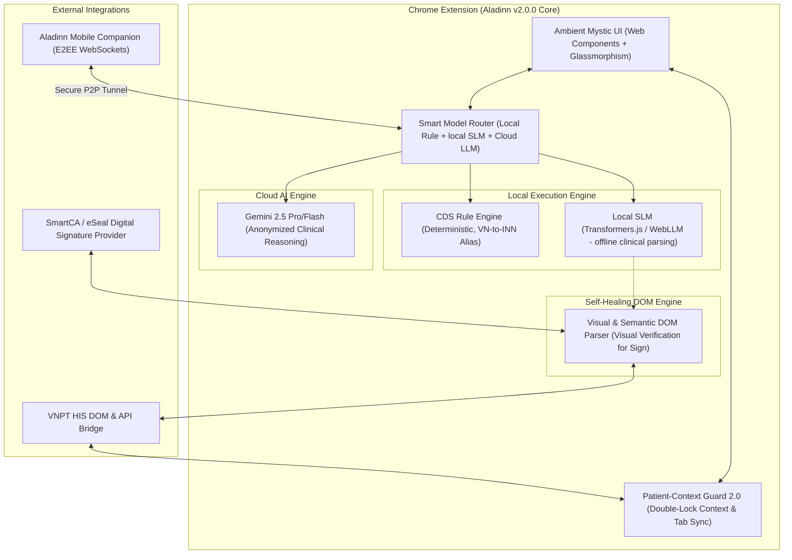

# 🧞 Aladinn 2.0.0 — Bản Thiết Kế Đột Phá: Hướng Tới "Clinical OS" Đích Thực

Dự án **Aladinn** đã trải qua hành trình phát triển ấn tượng, đạt mốc ổn định cao ở phiên bản 1.5.0 với các cải tiến quan trọng về an toàn dữ liệu, chống nhầm bệnh nhân (Patient Context Guard), lọc giao diện thông minh và Glassmorphic UI premium.

Để **bứt phá lên phiên bản 2.0.0**, Aladinn không chỉ dừng lại ở một công cụ tiện ích (Utility Extension) bổ trợ, mà cần chuyển mình thành một **Hệ điều hành Lâm sàng Thu nhỏ (Clinical OS)** tích hợp sâu, thông minh vượt trội, an toàn tuyệt đối và mang lại giá trị thực tiễn khổng lồ cho các bác sĩ Việt Nam.

Dưới đây là đề xuất chi tiết về **5 Trụ cột Đột phá Kỹ thuật & Trải nghiệm** cho Aladinn 2.0.0.

---

## 🗺️ Sơ đồ Kiến trúc Đề xuất v2.0.0 (Clinical OS Architecture)



---

## 🌟 5 Trụ cột Đột phá Phiên bản v2.0.0

### 1. Trí Tuệ Nhân Tạo Lai (Hybrid AI) & Biên Ngoại Tuyến (Offline Local SLM)
> **Mục tiêu**: Đảm bảo an toàn dữ liệu 100%, hoạt động ngay cả khi ngắt kết nối Internet (phù hợp với môi trường mạng nội bộ khép kín của nhiều bệnh viện) và tối ưu hóa chi phí token về 0.

*   **Tích hợp Mô hình Ngôn ngữ Nhỏ Cục bộ (Local SLM)**: Tận dụng **Transformers.js** hoặc **WebLLM** để chạy trực tiếp một mô hình ngôn ngữ cực nhỏ nhưng tối ưu tốt (như `Qwen-1.5B-Instruct` hoặc `Gemma-2B-Instruct`) bằng **WebGPU / WebNN** ngay trong trình duyệt của bác sĩ.
*   **Phân luồng Thông minh (Smart AI Routing)**:
    *   *Tác vụ cơ bản & Nhạy cảm (Tóm tắt bệnh án, Trích xuất thông tin lâm sàng từ giọng nói, Gợi ý mã ICD-10)*: Xử lý **100% offline** bằng Local SLM. Dữ liệu bệnh nhân (PHI) hoàn toàn không rời khỏi máy trạm.
    *   *Tác vụ phức tạp (Phân tích biện luận lâm sàng chuyên sâu, Hội chẩn đa chuyên khoa)*: Tự động mã hóa, khử định danh toàn bộ dữ liệu lâm sàng trước khi định tuyến lên đám mây (Gemini 2.5 Pro).
*   **Giá trị đột phá**: Bệnh viện không lo ngại vấn đề rò rỉ dữ liệu bệnh nhân ra ngoài internet, đáp ứng khắt khe nhất các tiêu chuẩn của Bộ Y tế và Luật An toàn Thông tin.

---

### 2. Trợ Lý Thầm Lặng (Ambient Clinical Intelligence) & Giao Diện Thích Ứng
> **Mục tiêu**: Chuyển đổi từ luồng làm việc "Click và Nói" sang "Lắng nghe Tự động" (Zero-Click). Bác sĩ chỉ cần tập trung trao đổi với người bệnh.

*   **Ambient Listening Mode (Chế độ Lắng nghe Phòng khám)**:
    *   Bác sĩ kích hoạt chế độ lắng nghe khi bắt đầu khám. Aladinn sẽ ghi nhận cuộc hội thoại tự nhiên giữa Bác sĩ - Bệnh nhân bằng tiếng Việt.
    *   Hệ thống tự lọc bỏ các câu thoại xã giao, trích xuất các thông tin chuyên môn lâm sàng (Lý do vào viện, Quá trình bệnh lý, Tiền sử, Triệu chứng cơ năng) và ánh xạ chính xác vào cấu trúc form bệnh án của VNPT HIS.
*   **Giao diện Thích ứng (Adaptive Clinical Overlay)**:
    *   Giao diện Glassmorphism 2.0 siêu mượt tích hợp các micro-interaction (rung nhẹ khi click, hiệu ứng chuyển động "Mystic Aura" nhịp nhàng theo trạng thái xử lý của AI).
    *   **Thanh chỉ số độ tin cậy (Confidence Bar)**: Hiển thị mức độ chính xác của dữ liệu trích xuất theo thời gian thực.
    *   **Draft Cards Sidebar**: Hiển thị nháp các thông tin chuẩn bị điền để bác sĩ duyệt nhanh bằng phím tắt trước khi tự động đổ vào HIS.

---

### 3. Cảnh Báo Lâm Sàng Chủ Động Thời Gian Thực (Proactive Real-Time CDS)
> **Mục tiêu**: Phát hiện sai sót điều trị và xuất huyết/tương tác thuốc ngay khi bác sĩ đang thao tác gõ đơn thuốc, thay vì quét sau khi đơn đã được kê xong.

*   **Hook Bàn phím & Keystroke Real-Time Scanning**:
    *   Tận dụng cơ chế bắt sự kiện trong các ô nhập liệu thuốc của HIS để nhận diện tên thuốc/biệt dược ngay khi bác sĩ đang gõ.
    *   Tra cứu tức thì trong cơ sở dữ liệu **426+ quy tắc tương tác thuốc** bản địa hóa và hệ thống bản đồ biệt dược viện (VN-to-INN Alias Mapping).
*   **Cảnh báo Liều lượng Cá thể hóa (Dynamic Dose Optimization)**:
    *   Tự động tính toán mức lọc cầu thận (eGFR / Creatinine Clearance) của bệnh nhân từ kết quả xét nghiệm sinh hóa gần nhất trong HIS.
    *   Nếu phát hiện suy gan/suy thận, Aladinn sẽ chủ động đưa ra cảnh báo điều chỉnh liều (Ví dụ: *"Bệnh nhân eGFR = 35 ml/phút, khuyến nghị giảm liều Enoxaparin xuống 30mg/24h"*).
*   **Cảnh báo Sai sót BHYT Tiền kiểm (BHYT Financial Guard)**:
    *   Kiểm tra sự phù hợp giữa chẩn đoán ICD-10 và chỉ định thuốc/dịch vụ kỹ thuật theo thông tư BHYT mới nhất nhằm hạn chế tối đa việc xuất toán viện phí.

---

### 4. Công Nghệ Tự Sửa Lỗi Giao Diện (Self-Healing DOM) & Ký Số Trực Quan 2.0
> **Mục tiêu**: Khắc phục triệt để điểm yếu cố hữu của Chrome Extension khi trang HIS cập nhật mã nguồn làm hỏng các Selector cũ, đồng thời nâng tầm an toàn ký số SmartCA.

*   **Self-Healing Selector Engine**:
    *   Không còn phụ thuộc vào các hardcoded ID/Class tĩnh. Aladinn 2.0.0 sẽ áp dụng thuật toán **Semantic Layout Matching** (phân tích cấu trúc form nhập liệu, nhãn văn bản lân cận, thuộc tính DOM) để tự tìm đúng ô nhập liệu ngay cả khi HIS thay đổi cấu trúc trang.
*   **Ký số Trực quan có Xác thực Thị giác (Visual Verify Auto-Sign)**:
    *   Trước khi ra lệnh ký tự động qua SmartCA, Aladinn sẽ sử dụng một mô hình thị giác máy tính siêu nhỏ (hoặc cơ chế phân tích PDF Canvas) để chụp và đối chiếu trực quan: Tên bệnh nhân hiển thị trên bản PDF chuẩn bị ký có khớp 100% với tên bệnh nhân đang mở trên phần mềm HIS hay không.
    *   **Cơ chế Hủy bỏ Khẩn cấp bằng Cử chỉ (Gesture Emergency Stop)**: Cho phép bác sĩ chỉ cần di chuột nhanh ra mép màn hình hoặc nhấn phím `ESC` để dừng ngay lập tức mọi tiến trình ký tự động nếu phát hiện sai sót.

---

### 5. Cầu Nối Di Động & OCR Thông Minh (Aladinn Mobile Companion & OCR Bridge)
> **Mục tiêu**: Xóa nhòa khoảng cách giữa hồ sơ giấy tờ, phim ảnh vật lý và phần mềm HIS trên máy tính.

*   **Ứng dụng Đồng hành Di động (Mobile PWA Companion)**:
    *   Một ứng dụng web chạy trên điện thoại cá nhân của bác sĩ, kết nối an toàn với Extension trên máy tính qua kênh truyền mật mã hóa đầu-cuối (E2EE WebSockets).
*   **Chụp ảnh và Đẩy Số liệu tức thì (Scan-to-HIS)**:
    *   Bác sĩ dùng điện thoại chụp ảnh vết thương, ảnh chụp X-quang/CT vật lý, hoặc tờ kết quả xét nghiệm từ viện khác mang đến.
    *   Aladinn Mobile thực hiện trích xuất chữ viết (OCR) và tự động truyền tải, điền thẳng dữ liệu vào trường thích hợp trên HIS máy tính, hoặc lưu trữ ảnh vào PACS nội bộ của HIS chỉ trong 1 giây.
*   **Biến điện thoại thành Wireless Mic**: Tận dụng micrô chất lượng cao của điện thoại để nhận diện giọng nói từ xa khi bác sĩ đang đi buồng, dữ liệu tự đồng bộ về máy trạm.

---

## 🛠️ Lộ trình Triển khai Đề xuất (Roadmap to 2.0.0)

Để đảm bảo an toàn tuyệt đối theo tiêu chí **"Correctness > speed"** của Aladinn Core, quá trình bứt phá lên 2.0.0 nên được chia làm 3 giai đoạn:

```
[ Giai đoạn 1: Gia cố & Core Engine ] ──> [ Giai đoạn 2: Trải nghiệm & Ambient ] ──> [ Giai đoạn 3: Hệ sinh thái v2 ]
      (Tự sửa lỗi DOM & Proactive CDS)            (Local SLM & Ambient Voice)            (Mobile Companion & Visual Sign)
```

### Giai đoạn 1: Gia cố & Core Engine (Tuần 1 - Tuần 2)
*   Xây dựng hệ thống tự sửa lỗi **Self-Healing DOM Engine** cho các form lâm sàng chính.
*   Nâng cấp CDS lên cơ chế **Proactive Key Hook** (bắt sự kiện gõ thuốc trực tiếp).
*   Tích hợp bộ tính toán liều lượng thuốc cá thể hóa dựa trên eGFR bệnh nhân.
*   *Chỉ số đo lường (KPI)*: Độ bền Selector tăng >95% khi giao diện HIS biến động; 0 lỗi rò rỉ dữ liệu qua cache.

### Giai đoạn 2: Trải nghiệm Lâm sàng & Ambient AI (Tuần 3 - Tuần 4)
*   Thử nghiệm tích hợp **Transformers.js** chạy cục bộ trong Service Worker để parse text offline.
*   Xây dựng luồng **Ambient Listening** (ghi âm hội thoại và trích xuất cấu trúc).
*   Thiết kế lại giao diện **Ambient Mystic Overlay** với hiệu ứng Glassmorphism mượt mà và trực quan hóa độ tin cậy.
*   *Chỉ số đo lường (KPI)*: Giảm thời gian nhập liệu thủ công của bác sĩ xuống dưới 50% thời gian thông thường; Tỷ lệ trích xuất đúng schema đạt >90%.

### Giai đoạn 3: Hệ sinh thái Di động & Siết chặt An toàn Ký số (Tuần 5 - Tuần 6)
*   Phát triển **Aladinn Mobile Companion** kết nối bảo mật qua WebSockets.
*   Hoàn thiện giải pháp **Visual Verify Auto-Sign** để so khớp hình ảnh tài liệu trước khi ký SmartCA.
*   Tổ chức đợt kiểm thử xâm nhập (Penetration Test) nội bộ cho luồng truyền tải dữ liệu di động ↔ máy tính.
*   Phát hành phiên bản chính thức Aladinn 2.0.0.

---

> [!TIP]
> **Khuyến nghị từ Antigravity**:
> Trụ cột **1 (Hybrid AI)** và **3 (Proactive CDS)** là những tính năng mang lại giá trị đột phá nhanh nhất và thiết thực nhất cho bác sĩ tại phòng khám, đồng thời dễ dàng đo lường hiệu quả (ROI). Chúng ta nên ưu tiên thiết lập nền tảng kỹ thuật cho 2 trụ cột này ngay từ giai đoạn khởi đầu của phiên bản 2.0.0.
