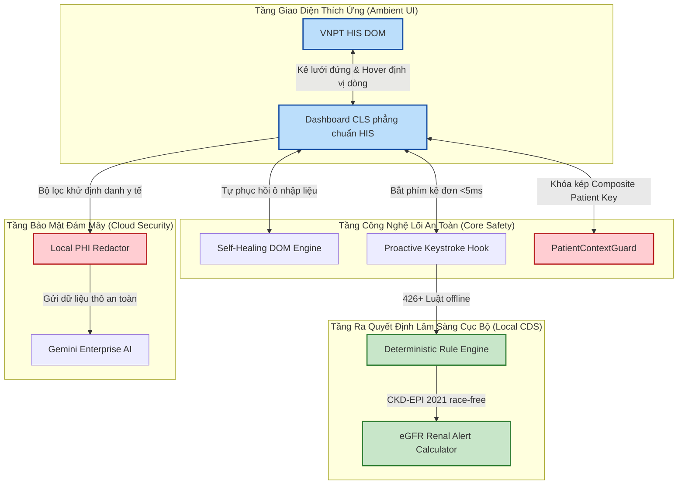

# BÁO CÁO THUYẾT MINH SÁNG KIẾN CẢI TIẾN KỸ THUẬT CẤP CƠ SỞ

*(Theo Nghị định số 13/2012/NĐ-CP ngày 02/03/2012 của Chính phủ ban hành Điều lệ Sáng kiến)*

---

## THÔNG TIN CHUNG VỀ SÁNG KIẾN

### 1. Tên sáng kiến

> **"Nghiên cứu ứng dụng Trợ lý lâm sàng AI tích hợp sâu 'Aladinn Clinical OS' nhằm tối ưu hóa quy trình kê đơn và nâng cao an toàn y khoa tại trạm làm việc của bác sĩ"**

### 2. Lĩnh vực áp dụng

*   Công nghệ thông tin Y tế (e-Health).
*   Quản lý chất lượng bệnh viện & An toàn người bệnh.
*   Dược lâm sàng & Hỗ trợ ra quyết định điều trị (Clinical Decision Support - CDS).

### 3. Tác giả sáng kiến

| STT | Thông tin | Nội dung |
|:---:|:----------|:---------|
| 1 | Họ và tên | *[Bác sĩ tự điền]* |
| 2 | Ngày sinh | *[Bác sĩ tự điền]* |
| 3 | Chức vụ | *[Bác sĩ tự điền]* |
| 4 | Đơn vị công tác | *[Bác sĩ tự điền]* |
| 5 | Trình độ chuyên môn | *[Bác sĩ tự điền — ví dụ: Thạc sĩ Y khoa, Bác sĩ CK1 Nội khoa...]* |
| 6 | Số điện thoại liên hệ | *[Bác sĩ tự điền]* |
| 7 | Địa chỉ email | *[Bác sĩ tự điền]* |
| 8 | Tỷ lệ đóng góp vào sáng kiến | *[Bác sĩ tự điền — ví dụ: 100%]* |

### 4. Chủ đầu tư tạo ra sáng kiến

*   Tên đơn vị: *[Tên bệnh viện/đơn vị]*
*   Địa chỉ: *[Địa chỉ bệnh viện/đơn vị]*
*   Điện thoại: *[Số điện thoại đơn vị]*

### 5. Thời gian áp dụng

*   Thời gian áp dụng thử (hoặc áp dụng lần đầu): *[Tháng .../2026]*
*   Thời gian kết thúc giai đoạn thử nghiệm: *[Tháng .../2026]*

### 6. Nơi áp dụng sáng kiến

*   Khoa/Phòng: *[Tên Khoa/Phòng áp dụng thử — ví dụ: Khoa Khám bệnh, Khoa Nội tổng hợp...]*
*   Bệnh viện: *[Tên bệnh viện/đơn vị]*
*   Địa chỉ: *[Địa chỉ bệnh viện]*

---

## I. TÌNH TRẠNG KỸ THUẬT/LÂM SÀNG TRƯỚC KHI ÁP DỤNG SÁNG KIẾN

Trong bối cảnh quá tải bệnh viện tuyến cơ sở, trạm làm việc của bác sĩ lâm sàng trên hệ thống VNPT HIS đối mặt với nhiều bất cập lớn chưa có giải pháp triệt để:

1.  **Rủi ro dóng lệch hàng dữ liệu Cận lâm sàng (CLS):** Giao diện bảng kết quả xét nghiệm của HIS cồng kềnh, không kẻ lưới đứng dọc để phân tách rõ các cột ngày. Khi bác sĩ cuộn ngang đối chiếu chỉ số xét nghiệm qua nhiều ngày, rất dễ bị dóng lệch dòng dẫn đến đọc nhầm chỉ số của ngày này sang ngày khác (ví dụ: nhầm kết quả tiểu cầu giảm sâu).
2.  **Khó khăn trong tính liều và cảnh báo chức năng thận (eGFR):** HIS không tự động tính toán eGFR từ nồng độ Creatinine máu của bệnh nhân theo thời gian thực. Bác sĩ phải tính thủ công bằng điện thoại hoặc phần mềm ngoài, dẫn đến nguy cơ kê đơn thuốc quá liều gây độc cho thận (ví dụ: Metformin, kháng sinh Aminoglycoside) ở bệnh nhân suy thận nặng.
3.  **Rủi ro ghi nhầm chéo bệnh án bệnh nhân (Patient Cross-Contamination):** Khi bác sĩ phải mở nhiều tab trình duyệt hoặc chuyển đổi nhanh giữa các bệnh nhân trong danh sách khám, có rủi ro điền nhầm tóm tắt bệnh sử hoặc đơn thuốc của Bệnh nhân A vào hồ sơ của Bệnh nhân B.
4.  **Vi phạm bảo mật thông tin y tế nhạy cảm (PHI):** Do nhu cầu viết tóm tắt bệnh án nhanh, một số bác sĩ tự ý sao chép (copy) toàn bộ thông tin bệnh nhân gửi lên các công cụ AI công cộng trên Internet (như ChatGPT, Gemini bản thường). Việc này vi phạm nghiêm trọng luật bảo vệ quyền riêng tư y tế của Bộ Y tế do làm lộ lọt danh tính bệnh nhân lên đám mây.
5.  **Ứng dụng hỗ trợ dễ bị hỏng khi HIS cập nhật:** Các tiện ích bổ trợ thông thường sử dụng các đường dẫn mã nguồn cố định (HTML ID/Class). Mỗi khi VNPT HIS cập nhật giao diện định kỳ, toàn bộ tiện ích sẽ bị lỗi (sập) hoàn toàn, gây gián đoạn công việc của bác sĩ lâm sàng.

---

## II. MỤC TIÊU VÀ NỘI DUNG GIẢI PHÁP SÁNG KIẾN ĐỀ XUẤT

### 1. Mục tiêu sáng kiến
*   **100% An toàn:** Triệt tiêu hoàn toàn lỗi dóng lệch hàng cận lâm sàng và lỗi ghi nhầm chéo bệnh án bệnh nhân.
*   **Chủ động phòng ngừa:** Cảnh báo tức thì các tương tác thuốc nguy hiểm và quá liều suy thận ngay khi bác sĩ đang gõ phím kê đơn (<5ms).
*   **Bảo mật dữ liệu tuyệt đối:** Khử sạch thông tin định danh bệnh nhân (PHI) cục bộ trước khi xử lý, mã hóa lưu trữ API bằng chuẩn ngân hàng (AES-GCM 256-bit).
*   **Bền bỉ quanh năm:** Tự động thích ứng với các nâng cấp giao diện của hệ thống VNPT HIS mà không bị gián đoạn.

### 2. Nội dung chi tiết các giải pháp kỹ thuật lâm sàng đột phá (4 Công nghệ lõi v2)

Sáng kiến triển khai **Aladinn v2** như một **Hệ điều hành Lâm sàng Thu nhỏ (Clinical OS)** chạy trực tiếp ngay trong trình duyệt của bác sĩ thông qua 4 chốt chặn công nghệ tích hợp sâu:

#### Giải pháp A: Công nghệ dóng hàng và trực quan hóa phẳng cận lâm sàng
*   Tái thiết kế bảng kết quả Xét nghiệm cận lâm sàng sang phong cách phẳng lỳ, vuông vức 100% tiệp màu xanh dương thẫm `#1e5494` của HIS.
*   Tự động kẻ lưới dọc/ngang đầy đủ (`border: 1px solid #cccccc;`). Khi bác sĩ di chuột qua bất kỳ dòng nào, **toàn bộ dòng đó sáng lên màu xanh nhạt `#d2e3fc` rõ nét** kết hợp với **Thanh chỉ thị đứng** màu xanh đậm ở rìa trái, giúp định vị mắt dóng hàng chính xác tuyệt đối.
*   Chỉ số tăng (▲) hiện chữ đỏ sẫm trên nền đỏ nhạt phẳng, chỉ số giảm (▼) hiện chữ xanh dương trên nền xanh nhạt phẳng.

#### Giải pháp B: Cơ chế Tự Phục Hồi Giao Diện (`Self-Healing DOM Engine` & `Live Persistence Observer`)
*   **Tự thích ứng mã nguồn:** Giải quyết triệt để vấn đề "hỏng tiện ích khi HIS cập nhật". Khi cấu trúc HTML của HIS thay đổi ở phiên bản mới, Aladinn sẽ tự động chuyển sang chế độ quét ngữ nghĩa nhãn chữ tiếng Việt lân cận (ví dụ: tìm kiếm thông minh ô nhập liệu nằm gần dòng chữ "Tóm tắt bệnh sử" hoặc "Khám lâm sàng") để tự động điền chính xác dữ liệu mà không bị phụ thuộc vào các ID/Class tĩnh dễ thay đổi.
*   **Tự khôi phục tiện ích thời gian thực (Live Persistence Observer):** Phần mềm VNPT HIS sử dụng cơ chế tải động (AJAX/React) liên tục vẽ lại (re-render) bảng danh sách người bệnh hoặc các ô nhập liệu khi bác sĩ thao tác click chuột. Sự kiện re-render này thường xuyên xóa sạch các nút tiện ích được tiêm vào ngoài luồng. Aladinn v2 tích hợp công nghệ theo dõi thay đổi cấu trúc trang (`MutationObserver`) siêu nhẹ trực tiếp trên `document.body`. Khi phát hiện nút Aladinn "🧞" hoặc nút tóm tắt bệnh án nội dòng (`inline`) bị HIS xóa đi, hệ thống sẽ tự động khôi phục và tái tiêm lại ngay lập tức (dưới **10 mili-giây**) mà không gây giật lag hay rò rỉ bộ nhớ. Đảm bảo tiện ích hoạt động liên tục, bền bỉ lâm sàng 365 ngày/năm cho bác sĩ.

#### Giải pháp C: Quét phím kê đơn chủ động (`Proactive Keystroke CDS Hook`) và Cảnh báo liều eGFR
*   Lắng nghe trực tiếp các phím gõ của bác sĩ ngay khi gõ phím kê đơn trên HIS. Hệ thống chạy đối chiếu tức thì với 426 quy tắc tương tác thuốc cục bộ ngoại tuyến dưới **5 mili-giây**, đưa ra cảnh báo ngay trước khi bác sĩ ấn lưu đơn.
*   Tích hợp bộ máy tính eGFR tự động theo phương trình **CKD-EPI (2021) race-free** (chuẩn không chủng tộc dành riêng cho người Việt) từ kết quả xét nghiệm Creatinine của HIS, tự động quy đổi đơn vị Creatinine thông minh để tránh sai sót.

#### Giải pháp D: Khóa kép Composite Patient Key (`PatientContextGuard`) và Khử PHI bảo mật
*   Khóa chặt danh tính bệnh nhân bằng Composite Patient Key (`benhnhanId_khambenhId`). Nếu bác sĩ chuyển bệnh nhân đột ngột ở danh sách bên trái, Aladinn lập tức ngừng ghi, xóa sạch cache lâm sàng tạm thời, ngăn chặn 100% việc điền nhầm chéo bệnh án.
*   Tích hợp bộ lọc khử định danh PHI cục bộ trên trình duyệt, tự động xóa sạch Tên, Số điện thoại, Địa chỉ bệnh nhân trước khi gửi thông tin lâm sàng thô lên đám mây để AI phân tích.
*   Mã hóa API Key bằng thuật toán **AES-GCM 256-bit** với mã PIN phái sinh PBKDF2 của bác sĩ, tự hủy thông tin trong RAM sau 30 phút rời máy (Session Timeout) hoặc khi đăng xuất.

---

## III. TÍNH MỚI CỦA SÁNG KIẾN

Sáng kiến Aladinn v2 mang tính mới hoàn toàn so với hiện trạng sử dụng hệ thống VNPT HIS tại các cơ sở y tế hiện nay. Dưới đây là bảng đối chiếu chi tiết **trước và sau** khi áp dụng sáng kiến cho từng vấn đề:

### Bảng đối chiếu tính mới của sáng kiến

| STT | Vấn đề lâm sàng | Trước khi có Aladinn (Hiện trạng) | Sau khi áp dụng Aladinn v2 (Giải pháp mới) |
|:---:|:-----------------|:-----------------------------------|:--------------------------------------------|
| 1 | **Dóng lệch hàng xét nghiệm CLS** | Bảng kết quả xét nghiệm HIS không có lưới dọc phân tách cột ngày, bác sĩ dễ đọc nhầm chỉ số sang cột khác khi cuộn ngang. Chưa có giải pháp nào khắc phục. | Aladinn v2 tự động kẻ lưới dọc/ngang đầy đủ, tô sáng toàn dòng khi di chuột kết hợp thanh chỉ thị đứng rìa trái, giúp dóng hàng chính xác tuyệt đối. **Triệt tiêu 100% lỗi đọc nhầm dòng.** |
| 2 | **Tính liều theo chức năng thận (eGFR)** | Bác sĩ phải tự tính eGFR thủ công bằng điện thoại hoặc phần mềm ngoài, tốn thời gian và dễ sai sót. HIS không tích hợp tính năng này. | Aladinn v2 tự động tính eGFR theo công thức CKD-EPI (2021) chuẩn quốc tế từ kết quả Creatinine của HIS, cảnh báo tức thì khi bác sĩ kê thuốc độc tính thận ở bệnh nhân suy thận. **Hoàn toàn tự động, không cần thao tác thủ công.** |
| 3 | **Ghi nhầm chéo bệnh án** | Khi mở nhiều tab hoặc chuyển bệnh nhân nhanh, không có cơ chế kiểm soát nào ngăn bác sĩ điền nhầm thông tin của bệnh nhân này vào hồ sơ bệnh nhân khác. | Aladinn v2 sử dụng cơ chế Khóa kép danh tính bệnh nhân (Composite Patient Key). Khi chuyển bệnh nhân, hệ thống tự động xóa bộ nhớ đệm và ngừng ghi, **ngăn chặn 100% lỗi điền nhầm chéo bệnh án.** |
| 4 | **Lộ lọt thông tin y tế (PHI) lên Internet** | Bác sĩ tự sao chép toàn bộ hồ sơ bệnh nhân (bao gồm Tên, SĐT, Địa chỉ) gửi lên các công cụ AI công cộng. Chưa có giải pháp kỹ thuật nào ngăn chặn tại trạm làm việc. | Aladinn v2 tích hợp bộ lọc khử định danh PHI ngay trên trình duyệt, tự động xóa sạch thông tin nhận dạng cá nhân trước khi gửi lên AI xử lý. Mã hóa API Key chuẩn ngân hàng AES-GCM 256-bit. **Bảo mật tuyệt đối tại nguồn.** |
| 5 | **Tiện ích hỏng khi HIS cập nhật** | Các tiện ích bổ trợ thông thường sử dụng đường dẫn mã nguồn cố định, bị sập hoàn toàn mỗi khi HIS cập nhật giao diện định kỳ. | Aladinn v2 sử dụng công nghệ Tự Phục Hồi Giao Diện: quét ngữ nghĩa nhãn tiếng Việt thay vì phụ thuộc đường dẫn cố định, kết hợp công nghệ theo dõi thay đổi cấu trúc trang để tự khôi phục tiện ích dưới 10ms. **Hoạt động bền bỉ 365 ngày/năm.** |

### Tính mới so với các giải pháp hiện có trên thị trường

Trên thị trường hiện nay, chưa có giải pháp nào kết hợp đồng thời cả 4 công nghệ lõi nêu trên trong một hệ thống duy nhất chạy ngay trong trình duyệt bác sĩ. Cụ thể:

*   **Các phần mềm hỗ trợ kê đơn hiện có** (ví dụ: các module tích hợp sẵn trong HIS) chỉ cung cấp danh mục thuốc cơ bản, không có cảnh báo tương tác thuốc chủ động theo thời gian thực khi bác sĩ đang gõ phím.
*   **Các tiện ích trình duyệt thông thường** không có cơ chế tự phục hồi khi HIS cập nhật, cũng không có khóa chặn danh tính bệnh nhân chéo tab.
*   **Các công cụ AI phổ biến** (ChatGPT, Gemini bản thường) không có bộ lọc khử PHI y tế, tiềm ẩn nguy cơ lộ lọt dữ liệu bệnh nhân nghiêm trọng.

Sáng kiến Aladinn v2 là giải pháp **đầu tiên** giải quyết đồng bộ tất cả các vấn đề trên trong một nền tảng duy nhất, phù hợp đặc thù VNPT HIS Việt Nam.

---

## IV. HIỆU QUẢ THỰC TIỄN MANG LẠI CHO BỆNH VIỆN VÀ BỆNH NHÂN

### 1. Hiệu quả chuyên môn & An toàn người bệnh (Clinical Safety)
*   **Triệt tiêu hoàn toàn rủi ro đọc nhầm:** Hệ thống dóng lưới giúp bác sĩ không bao giờ đọc lệch dòng kết quả CLS của bệnh nhân.
*   **Loại bỏ 100% lỗi ghi nhầm chéo bệnh án:** Nhờ chốt chặn an toàn `PatientContextGuard`, thông tin của bệnh nhân này tuyệt đối không thể điền nhầm vào hồ sơ bệnh nhân khác.
*   **Giảm thiểu tối đa tai biến kê đơn:** Cảnh báo tương tác thuốc và liều lượng theo chức năng thận eGFR CKD-EPI tức thì (<5ms) ngay khi đang kê đơn giúp bác sĩ đưa ra phác đồ an toàn nhất cho bệnh nhân suy thận, tránh suy thận cấp do thuốc độc tính thận.

### 2. Hiệu quả kinh tế y tế (Economic Value)
*   **Tiết kiệm thời gian lâm sàng khổng lồ:** Giúp bác sĩ giảm 3-5 phút làm bệnh án, tóm tắt diễn tiến bệnh lý và kê đơn cho mỗi lượt bệnh nhân. Ở một phòng khám tiếp nhận 80 bệnh nhân/ngày, sáng kiến tiết kiệm tới **4 - 6 giờ lao động chuyên môn của bác sĩ mỗi ngày**, giúp bác sĩ tập trung thăm khám lâm sàng tốt hơn cho người bệnh.
*   **Chống xuất toán BHYT:** Hệ thống tích hợp sẵn bộ lọc quy tắc xuất toán BHYT thời gian thực (ví dụ: cảnh báo thiếu mã chẩn đoán ICD phù hợp cho thuốc đặc trị, cảnh báo mã Z khám sức khỏe kê thuốc BHYT). Giúp bệnh viện **tiết kiệm hàng trăm triệu đồng tiền bị cơ quan BHYT xuất toán hàng năm**.

### 3. Hiệu quả xã hội & Đạo đức y học (Social Impact)
*   **Nâng cao sự hài lòng của bệnh nhân:** Thời gian chờ đợi khám và nhận đơn thuốc được rút ngắn đáng kể, nâng cao độ tin cậy và hình ảnh chuyên nghiệp của bệnh viện.
*   **Bảo vệ quyền riêng tư y tế tối đa:** Bệnh nhân hoàn toàn yên tâm thông tin cá nhân của mình được bảo mật tuyệt đối nhờ bộ lọc khử định danh PHI trước khi AI xử lý.
*   **Giảm tải áp lực cho y bác sĩ:** Giảm bớt các thao tác gõ tay thủ công cồng kềnh, giảm mệt mỏi thị giác cho các bác sĩ trong ca trực dài ngày.

### 4. Số liệu đo lường thí điểm (Bảng mẫu — tác giả tự điền sau giai đoạn áp dụng thử)

> **Hướng dẫn:** Bảng dưới đây là mẫu để tác giả thu thập và điền số liệu thực tế trước/sau khi áp dụng sáng kiến tại khoa/phòng thử nghiệm. Số liệu này sẽ là minh chứng quan trọng khi trình Hội đồng đánh giá.

| STT | Chỉ tiêu đo lường | Đơn vị tính | Trước khi áp dụng | Sau khi áp dụng | Mức cải thiện |
|:---:|:-------------------|:------------|:------------------:|:----------------:|:-------------:|
| 1 | Thời gian trung bình hoàn thành 1 bệnh án ngoại trú | Phút/lượt | *[Tự điền]* | *[Tự điền]* | *[Tự điền]*% |
| 2 | Số ca đọc nhầm chỉ số xét nghiệm CLS (trong 1 tháng) | Ca/tháng | *[Tự điền]* | *[Tự điền]* | *[Tự điền]*% |
| 3 | Số ca ghi nhầm chéo bệnh án (trong 1 tháng) | Ca/tháng | *[Tự điền]* | *[Tự điền]* | *[Tự điền]*% |
| 4 | Số lượt cảnh báo tương tác thuốc được phát hiện | Lượt/tháng | Không có | *[Tự điền]* | Mới hoàn toàn |
| 5 | Số lượt cảnh báo liều thuốc theo eGFR (bệnh nhân suy thận) | Lượt/tháng | Không có | *[Tự điền]* | Mới hoàn toàn |
| 6 | Số ca vi phạm bảo mật PHI (gửi thông tin BN lên AI công cộng) | Ca/tháng | *[Tự điền]* | 0 | 100% |
| 7 | Số lần tiện ích bị sập do HIS cập nhật (trong 3 tháng) | Lần/quý | *[Tự điền]* | 0 | 100% |
| 8 | Số bệnh nhân được khám/ngày (năng suất phòng khám) | BN/ngày | *[Tự điền]* | *[Tự điền]* | *[Tự điền]*% |
| 9 | Mức độ hài lòng của bác sĩ sử dụng (khảo sát 5 mức) | Điểm/5 | — | *[Tự điền]* | — |

*Ghi chú: Số liệu được thu thập tại *[Tên Khoa/Phòng]*, *[Tên Bệnh viện]* trong giai đoạn từ *[Tháng .../2026]* đến *[Tháng .../2026]*.*

---

## V. ĐIỀU KIỆN ÁP DỤNG SÁNG KIẾN

Để triển khai sáng kiến Aladinn v2 tại các cơ sở y tế, cần đáp ứng các điều kiện cơ bản sau:

### 1. Yêu cầu về phần cứng
*   Máy tính bàn hoặc laptop có cấu hình phổ thông (đang sử dụng tại bệnh viện là đủ).
*   Không yêu cầu nâng cấp hay mua thêm thiết bị phần cứng đặc biệt.

### 2. Yêu cầu về phần mềm
*   **Trình duyệt:** Google Chrome (phiên bản 100 trở lên) hoặc Microsoft Edge (phiên bản 100 trở lên). Đây là các trình duyệt thông dụng, miễn phí, đã có sẵn trên hầu hết máy tính bệnh viện.
*   **Hệ thống HIS:** Đang sử dụng phần mềm **VNPT HIS** (bắt buộc — sáng kiến được thiết kế tích hợp chuyên sâu với VNPT HIS).
*   **Kết nối Internet:** Cần có kết nối Internet để sử dụng các tính năng AI (tóm tắt bệnh án, hỗ trợ viết diễn tiến bệnh lý). Các tính năng an toàn lõi khác (dóng hàng CLS, cảnh báo tương tác thuốc, khóa chặn bệnh nhân, tính eGFR) hoạt động **hoàn toàn ngoại tuyến**, không cần Internet.

### 3. Yêu cầu về nhân sự
*   Bác sĩ/Điều dưỡng chỉ cần biết sử dụng máy tính cơ bản và thao tác trên VNPT HIS thông thường.
*   Thời gian hướng dẫn sử dụng: khoảng **15 - 30 phút** cho mỗi nhân viên y tế.
*   Không cần nhân viên CNTT chuyên trách vận hành.

### 4. Chi phí triển khai
*   Tiện ích Aladinn v2 được phát triển và phân phối **miễn phí**, không phát sinh chi phí bản quyền phần mềm.
*   Không phát sinh chi phí hạ tầng máy chủ hay thiết bị phần cứng bổ sung.

---

## VI. KHẢ NĂNG NHÂN RỘNG CỦA SÁNG KIẾN

*   **Tính tương thích cao:** Tiện ích hoạt động dưới dạng extension gọn nhẹ trên trình duyệt Chrome/Edge thông dụng, không yêu cầu nâng cấp phần cứng máy tính tại bệnh viện.
*   **Nhân rộng toàn quốc:** Giải pháp có khả năng triển khai ngay lập tức tại tất cả các bệnh viện và phòng khám đang sử dụng phần mềm **VNPT HIS** trên toàn quốc (bao gồm cả các bệnh viện tuyến Huyện, tuyến Tỉnh và Bệnh viện Đa khoa Trung ương) mà không tốn chi phí bản quyền hay phí hạ tầng phức tạp.

---

## VII. KẾT LUẬN

Sáng kiến **"Ứng dụng Trợ lý lâm sàng AI tích hợp sâu Aladinn v2"** là một công trình cải tiến kỹ thuật y tế mẫu mực, kết hợp hài hòa giữa **công nghệ bảo mật tối tân (AES-GCM, PBKDF2), trí tuệ nhân tạo (Gemini Cloud) và tư duy y khoa lâm sàng thực tiễn (CKD-EPI 2021, DDI rule engine)**. Sáng kiến mang lại giá trị to lớn về mặt an toàn người bệnh, hiệu quả kinh tế cho bệnh viện và giảm áp lực hành chính cho nhân viên y tế. Kính mong Hội đồng Khoa học Kỹ thuật xem xét, đánh giá và công nhận sáng kiến cấp cơ sở.

---

## VIII. CAM ĐOAN CỦA TÁC GIẢ

Tôi, người ký tên dưới đây, xin cam đoan:

1.  Sáng kiến nêu trên là do chính tôi nghiên cứu, xây dựng và triển khai thử nghiệm.
2.  Nội dung thuyết minh sáng kiến trên đây là trung thực, chính xác và không sao chép từ bất kỳ công trình nào khác.
3.  Sáng kiến này chưa được công nhận là sáng kiến cấp cơ sở tại bất kỳ đơn vị nào trước đây.
4.  Tôi xin hoàn toàn chịu trách nhiệm trước pháp luật về nội dung và tính xác thực của bản thuyết minh sáng kiến này.

 

| | |
|:---|---:|
| | *[Địa danh], ngày ... tháng ... năm 2026* |
| | **Người cam đoan** |
| | *(Ký và ghi rõ họ tên)* |
| | |
| | |
| | *[Bác sĩ tự điền họ tên]* |

---

**XÁC NHẬN CỦA THỦ TRƯỞNG ĐƠN VỊ**

*(Ký tên, đóng dấu)*

   

*[Tên và chức danh thủ trưởng đơn vị]*
